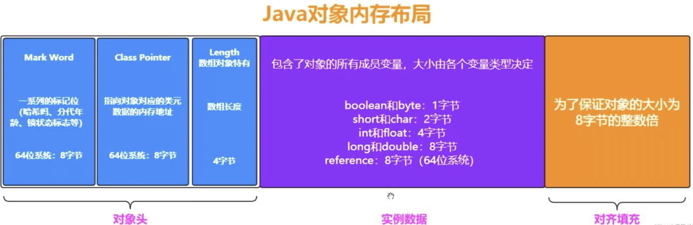
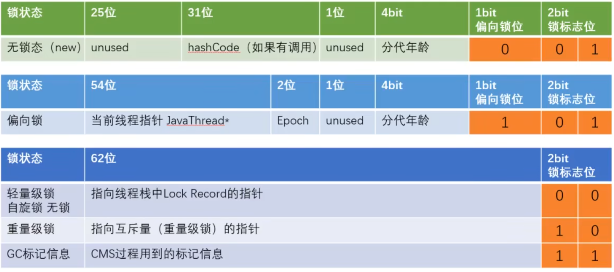
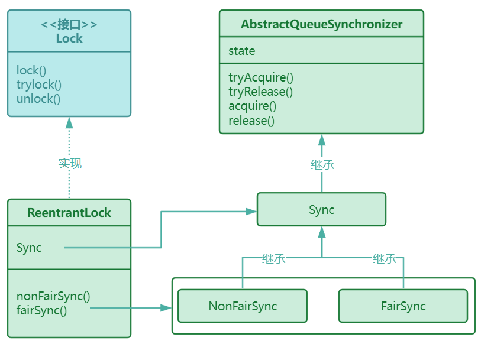
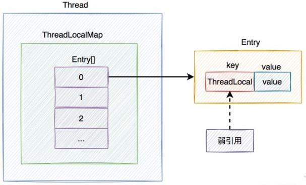

# 面试 Java基础

## 语言基础

### 1. new一个空的Object对象，占用多少个字节？

**16字节**。空Object对象的内存占用问题涉及到**Java对象的内存模型**，Java对象的内存模型结构如下所示。



一个Java对象其内存包含三个部分：**对象头**、**实例数据**、**对齐填充**，其中对象头默认占用16字节，实例数据依照类型的不同不尽相同，对其填充依据前两部分决定，使整个对象占用字节数为8的整数倍。例如Object对象，对象头16字节，实例数据0字节，对齐即为0字节，其前两部分总占用为8的两倍，无需填充。

**Object Header对象头**
对象头主要包含两个部分：**Mark Word(8字节)**和**Class Pointer(8字节)**，如果是数组对象则还有一个**Length(4字节)**字段存储数组的长度。
**Mark Word**用于存储对象的运行时状态，其中包括锁状态、分代年龄、hashcode、GC标记等信息。为了在8字节中放下尽可能多的信息，Mark Word在对象的不同状态下字段分布是不同的，具体的分布如下图所示。



**Class Pointer**用于保存指向当前对象的类的元数据地址的指针，通过这个指针可以获取到对象的类型信息。

**实例数据**
实例数据是对象存储的真正有效信息，即自身或者继承自父类的属性，根据实际包含的数据的不同长度不同。

**对其填充**
JVM中内存管理要求对象的起始地址必须是8字节的整数倍，因此使用对其填充保证内存对齐。


### 2. 两个线程同时写HashMap会发生什么？

**1 丢失元素**
多线程同时put的时候，如果发生hash碰撞且hash值相同但equals结果不同，可能多个元素都落在链表的头部，从而造成元素覆盖。

**2 链表形成闭环**
在JDK1.7及以前，由于链表在扩容时会进行逆转，多线程操作map扩容时会发生链表形成闭环的情况。参考[这里](https://blog.csdn.net/qq_29978863/article/details/106061801)


### 3. 有哪些线程安全的Map？常用数据结构的线程安全版本？

#### 常见的Map

常见的Map包括：**HashMap**、**HashTable**、**LinkedHashMap**、**TreeMap**、**ConcurrentHashMap**、**ConcurrentSkipListMap**

**HashMap**
最常用的Map类型，根据Key的Hash值存储和查找K-V对，具备接近O(1)的访问速度，不具备线程安全性。HashMap最多允许一条Key为null，允许多个Value为null。
**HashTable**
HashMap的线程安全版本，使用synchronized关键字同步，效率较低。HashTable不允许Key或Value存在null。
**TreeMap**
TreeMap的底层实现为红黑树，其根据Key对K-V对进行排序，默认为升序排序。TreeMap不允许Key为null(需要排序)，但允许Value为null。TreeMap是非线程安全的。
**LinkedHashMap**
保存了K-V插入的顺序，使用迭代器遍历时，会按照插入的先后顺序得到K-V对，Key和Value均可为null。LinkedHashMap是非线程安全的。
**ConcurrentHashMap**
常用的线程安全版本的HashMap，使用`CAS`机制和细粒度的Hash槽锁实现线程同步，相比HashTable而言效率较高。
**ConcurrentSkipListMap**
类似于TreeMap，根据Key对K-V对进行排序，是有序的Map，区别在于TreeMap使用红黑树实现，而ConcurrentSkipListMap使用跳表实现，且其为线程安全的Map，不支持Key或Value为null。
相对于ConcurrentHashMap而言，其在并发相对较低的情况下读写速率较低(跳表为$O(\log{n})$，哈希为$O(1)$)，但是在较高的并发场景下，跳表结构加锁范围较小，因此ConcurrentSkipListMap能够提供更高的并发度。

#### 不太常见的Map

java.util包下还包含了一些用于特殊场景的Map：**IdentityHashMap**、**EnumMap**、**WeakHashMap**、**Properties**

**IdentityHashMap**
类似于HashMap，区别在于其使用`==`比较Key是否相同，而非HashMap中使用`==`和`equals()`函数同时比较，其支持Key和Value都为null。IdentityHashMap是非线程安全的。
**EnumMap**
使用枚举类型作为Key的Map，其底层使用双数组保存K-V对(K[]和V[])，不支持Key为null但支持Value为null。其为非线程安全的。
**WeakHashMap**
基于**弱引用**实现的HashMap，Map对其中所有的K-V的引用都是弱引用，因此当没有额外的强引用链接对应的K-V对时，该K-V对在GC时会被清除，这种特性使其在用作缓存时很有效。WeakHashMap支持Key或Value为null，其为非线程安全的。
**Properties**
Properties继承自HashTable，其默认的K-V类型均为String，不允许Key或Value为null，其为线程安全的。Properties通常用于保存一组持久的属性。

线程安全的Map包括：**HashTable**、**ConcurrentHashMap**、**ConcurrentSkipListMap**、**Properties**，其中前三种是常见的线程安全map。
对于任何非线程安全的Map可以使用**Collections.synchronizedMap()**方法对其进行包装，使之支持多线程环境，但由于SynchronizedMap使用synchronized关键字对mutex对象加锁实现同步，因此效率不高。

#### 常用数据结构的线程安全版本

**List**
**Vector**、**SynchronizedList**使用加锁的方式实现同步，适用于写较多的场景；**CopyOnWriteList**在写操作时使用ReentrantLock对数组加锁并复制原数组，在复制得到的新数组上做写操作，实现读写分离，适用于读较多的场景。

**Set**
Set集合类可以根据Map集合使用`Collections.newSetFromMap()`方法得到，即任意Map都可以直接转化为Set集合类使用，因此线程安全的Map即对应线程安全的Set。此外，由于`Collections.synchronizedSet()`方法的存在，可以将任意Set集合通过synchronized方式转化为线程安全的集合。


### 4. 红黑树如何实现的？


### 5. ConcurrentHashMap中put的过程？


### 6. 快速失败和安全失败？

java.util包下的类都属于**快速失败**，java.util.concurrent包下的类都属于**安全失败**。

**快速失败**
在使用迭代器对集合对象进行遍历的时候，若有其他线程对集合进行了修改或遍历过程中对集合进行了修改，则集合对象将会抛出ConcurrentmodificationException异常。

本质原因：集合类会维护一个modCount变量记录集合修改的次数，迭代器初始化时会使用当前的modCount初始化一个expectedModCount，每次调用next()方法都会检查二者是否相等，若相同则继续进行，否则抛出ConcurrentmodificationException异常。

解决方法：
①在使用迭代器遍历过程中，使用迭代器执行集合修改操作，避免出现modCount和expectedModCount不一致的情况。
②不使用迭代器遍历，使用for循环遍历，在循环中直接操作集合对象。

```java
/* 1. 使用迭代器的remove方法可以避免快速失败 */
while (iterator.hasNext()) {
    if (iterator.next().equals(2)) {
    	iterator.remove();
    }
}
/* 2. 使用for循环遍历操作，不使用迭代器 */
for (int i = 0; i < list.size(); i++) {
    if (list.get(i).equals(3)) {
        list.remove(i);
    }
}
```

**安全失败**

采用安全失败机制的集合容器，使用迭代器遍历时，不直接在原始集合上遍历，而复制原有集合内容，在拷贝集合上进行遍历，遍历过程中对集合的操作不影响迭代器的拷贝数据，因此不会抛出ConcurrentmodificationException异常。


### 7. 什么是注解？

注解是Java5开始引入的一种类型，其类似于一个标签，将一个类进行标注。注解使用`@interface`进行定义。注解中不能包含方法，仅能包含成员变量，其成员变量以方法的形式声明。注解的基本定义方式如下：

```java
@interface TestAnnotation {
	String slogan() default "HELLO WORLD";  // 添加slogan属性，定义默认值为HELLO WORLD
}
```

以上代码段定义了一个基本的`@TestAnnotation`注解，其包含一个solgan属性，默认值为"HELLO WORLD"。Java中预置了一些注解：
**@Deprecated**：用于标注不推荐使用的，过时的类或方法。
**@Override**：用于标注需要重写的方法。
**@SuppressWarnings**：用于阻止警告。
**@SafeVarargs**：用于提醒开发者不要使用参数做一些不安全的操作。
**@FunctionalInterface**：函数式接口，修饰一个接口，表明这个接口只能包含一个方法，属于函数式接口。

除上述普通的注解外，还有一些用于注解注解的注解，被称之为元注解。

**元注解**
元注解是一种基本注解，可以应用到其他注解之上，定义其他注解的属性。元注解有5种分别为：`@Retention`、`@Documented`、`@Target`、`@Inherited`、`@Repeatable`。

**@Retention**
@Retention仅能作用于注解上，用于注明注解的存活时间，其可以取三种值：
`RetentionPolicy.SOURCE`：注解只在源码中保留，编译器编译时将被忽略。
`RetentionPolicy.CLASS`：注解保留至字节码中，但会被JVM运行时忽略。
`RetentionPolicy.RUNTIME`：注解保留至运行时，程序运行时将被读取。
使用如下方式即可对注解使用元注解：

```java
// 定义一个仅在源码中出现的注解
@Retention(RetentionPolicy.SOURCE)
@interface TestAnnotation {}
```

**@Documented**
@Documented仅作用于注解，能够将被注解的对象包含到Javadoc中。

**@Target**
@Target指定了注解能够使用的地方，限制注解的作用范围。其可取值如下所示：
`ElementType.ANNOTATION_TYPE`：能够应用于一个注解。
`ElementType.CONSTRUCTOR`：应用于构造方法。
`ElementType.FIELD`：应用于属性。
`ElementType.LOCAL_VARIABLE`：应用于局部变量。
`ElementType.METHOD`：应用于方法。
`ElementType.PACKAGE`：应用于包。
`ElementType.PARAMETER`：应用于方法的参数。
`ElementType.TYPE`：应用于类型，如class、interface、enum。

**@Inherited**
@Inherited继承，作用于类注解。指定被@Inherited修饰的类注解可以由被注解的类的子类继承。

```java
// 使用@Inherited修饰@Rich注解，使其可被继承
@Inherited
@interface Rich {}

// 使用@Rich注解修饰RichParent类，其子类若被其他注解修饰，则其子类自动继承@Rich注解
@Rich
class RichParent {}

// RichChild类继承自RichParent，且没有被其他注解修饰，因此其自动继承@Rich
class RichChild extends RichParent {}
```

**@Repeatable**
@Repeatable是Java8引入的元注解，由@Repeatable修饰的注解可以成为其他注解容器的元素，这样可以通过注解容器的方式一次性为被修饰类添加多个特性。其使用方式如下：

```java
// 定义一个注解容器
@interface Tag {
    Person[]  value();
}
// 使用Repeatable修饰Person，使其作为Tag的容器元素
@Repeatable(Tag.class)
@interface @Person修饰{
    String role();
}
// 使用@Person修饰StrongMan，并配置多种不同的角色
@Person(role="photographer")
@Person(role="coder")
class StrongMan{}
```

注解本身并不具备特别强大的功能，但是可以结合反射，使注解包含强大的能力。通过反射获取被注解修饰的类，再获取其方法和属性，通过这种方式实现对被修饰类的增强。这种方式可以将注解本身和注解的功能代码分离，通常用于：① 提供信息给编译器；② 提供编译处理；③ 运行时处理。


### 8. 有界队列和无界队列的区别？

**有界队列**
队列容量有一个固定大小的上限，一旦队列中的数据总量达到这个上限时，队列会对添加操作进行处理。比如：返回false、抛出异常、操作线程阻塞等。
常见的有界队列：ArrayBlockingQueue、SynchronousQueue。

**无界队列**
队列容量没有一个固定大小的上限，或者容量上限值是一个很大的理论上限值(Integer.MAX_VALUE)。由于这种队列理论上没有容量上限，因此理论上调用者可以将任意数量的数据对象添加到集合中，而不会使添加操作出现容量异常。无界队列低层通常使用CAS机制实现同步。
常见的无界队列：LinkedBlockingQueue、ConcurrentLinkedQueue、PriorityBlockingQueue、DelayedQueue 


### 9. 如何理解String？创建字符串有几种方式？有什么区别？new String("hello")创建了几个对象？

String类是Java中用于存储字符串的类型，其内部包含一个`private final char value[] `属性用于存储字符串的内容，由于其为char数组常量，因此String类型的字符串是不可改变的，当改变字符串时本质上是创建了一个StringBuilder作修改操作再toString()转换为新的字符串。

**String的创建方式**
① 使用字符串常量直接创建。首先编译器会将字符串常量放入常量池中，编译器会使用常量池中的值赋值给字符串的变量名引用。整个过程创建**一个字符串对象**，该对象位于常量池中。代码如下：

```java
String s = "hello";
System.out.println(s=="hello"); // true，二者为同一个对象
```

② 使用String构造方法创建。首先编译器将字符串常量放入常量池，读取new关键字时，调用String构造函数在堆区创建一个String对象，并复制常量池中的字符串常量的value引用给String对象，完成字符串的创建。整个过程创建了**两个字符串对象**，一个是常量池中的`"hello"`，一个是堆区的字符串对象。尽管二者是不同的对象，但二者的value是相同的char[]常量引用。除了需要复制String时，Java官方并不推荐使用第二种方式。代码如下：

```java
String s = new String("hello");
System.out.println(s=="hello"); // false，二者为不同的对象
```

**intern()方法**
String有一个intern()方法用于将字符串放入常量池中，并返回其引用。当调用intern()方法时，判断常量池中是否包含与当前字符串相同(equals()判断)的字符串实例，若有直接返回其引用；否则，将当前字符串移入常量池，并返回当前的引用。

```java
String s = new String("hello");
System.out.println(s=="hello");  // false，s位于堆区，"hello"位于常量池
s = s.intern();
System.out.println(s=="hello");  // true，s被替换为常量池中的"hello"字符串
```

**String不变性的优势**
① 节约内存。字符串不可变时，可将其放至常量池保存，通过将多个内容相同的字符串变量指向同一个常量池字符串可以极大地节约堆空间。
② 保证线程安全。由于字符串不可变，创建后仅可读，其本身不会被修改，因此多线程共享时没有同步问题，其自身即为线程安全的。
③ 适用于作Key。由于其不可变，创建后HashCode也为固定值不会更改也无需重新计算，在HashSet和HashMap中适用于作为Key。


### 10. 引用、指针和句柄的区别？

**指针**
指针是一个变量，用于指向一个内存中的地址。通过指针访问内存是间接访问。

**引用**
引用是对象的别名，其直接指向对象的内存区域，不可变动。通过引用访问内存是直接访问。

**句柄**
句柄本质上是一个整型id，代表一系列指针中的某一个指针。使用句柄时，根据句柄索引至对应的指针，再通过指针访问对应的内存。句柄对指针进行了封装，使句柄的使用者可以不关心具体的指针指向，当内存改变时，只需要改变句柄对应的指针即可，内存变更对上层用户是无感的。OS管理虚拟内存时即使用句柄。


### 11. Java的基本数据类型有哪些？

Java中包含8中基本数据类型，分别为：byte、short、int、float、long、double、char、boolean，其中前6种为数值类型，char为字符类型，boolean为布尔类型。其基本参数如下所示：

|      | 数据类型 |     长度      | 默认值 |             取值范围              |
| :--: | :------: | :-----------: | :----: | :-------------------------------: |
|  1   |   byte   | 1字节(8 bit)  |   0    |         $-2^7$ ~ $2^7-1$          |
|  2   |  short   | 2字节(16 bit) |   0    |      $-2^{15}$ ~ $2^{15}-1$       |
|  3   |   int    | 4字节(32 bit) |   0    |      $-2^{31}$ ~ $2^{31}-1$       |
|  4   |   long   | 8字节(64 bit) |   0l   |      $-2^{63}$ ~ $2^{63}-1$       |
|  5   |  float   | 4字节(32 bit) |  0.0f  |  $-2^{128}$ ~ $2^{128}$ (非精确)  |
|  6   |  double  | 8字节(64 bit) |  0.0   | $-2^{1024}$ ~ $2^{1024}$ (非精确) |
|  7   |   char   | 2字节(16 bit) |   空   |    0 ~ $2^{16}-1$ (255个字符)     |
|  8   | boolean  | 1字节(8 bit)  | false  |            true、false            |

**补码表示**
对于有符号数，Java中采用补码表示，补码的定义为：①正数为其原码；②负数为**正数的原码**取反加一。以byte为例，对于0而言，在表示上存在00000000(+0)和10000000(-0)，其中10000000表示-0是没有意义的，而且其刚好对应于-128的补码形式，因此使用10000000表示-128。这样负数就比正数多表示一位。

**float结构**
float使用3个部分表示一个数：符号位、指数位和尾数位。
① S符号位占1bit，用于表示正负，0为正，1为负。
② E指数位占8bit，取值范围为0-255，由于规定了全0和全1为非正规形式，因此实际表示范围为1-254。该部分实际表示时以2为底数，并对E减去127使其能够以负数的形式表示小数：$ 2^{E-127} $，实际的指数部分表示范围为：$ 2^{-126} $ ~ $ 2^{127} $。
③ M尾数位占23bit，表示小数部分的尾数，形式为1.M或0.M，具体是1.M或0.M由指数和尾数共同决定。
float的具体表示形式为：$ (-1^S) × (2^{E-127}) × (0.M | 1.M) $。

**double结构**
double的结构类似于float，但double的长度更大，取值范围也更大。double中符号位S占1bit，指数位E占11bit，尾数为M占52bit，其表示形式为：$ (-1^S) × (2^{E-1023}) × (0.M | 1.M) $。


### 12. Java类型擦除是什么？


## JVM

### 1. JVM中对象的垃圾回收如何判定？

常用的GC判定算法：**引用计数法**和**可达性分析**。

**引用计数法**
在对象中添加一个引用计数器，每当有一个地方引用这个对象，计数器加一；当引用失效时，计数器减一；当计数器的值为0时，对象被认为不可用，对内存对象进行回收。
引用计数法存在的问题：当两个对象相互引用但没有任何其他地方引用二者时，二者计数器都不为0，系统会认为不可回收，但事实上这两个对象已经失效。

**可达性分析**
通过一系列GC Roots的根对象作为起始节点，从这些结点开始根据引用关系向下搜索，搜索过的路径称为引用链，若某对象没有与任何引用链相连，则判定其为不可达，准备对其进行清理操作。
可以用作GC Roots的对象：①虚拟机栈中的的对象、②方法区中静态属性引用的对象、③方法区常量池引用的对象、④本地方法栈中的JNI引用的对象。

方法区(元数据区)中的对象通常为类对象，其回收判定较为严格，需要满足三个条件：① Java堆中不存在该类的任何实例对象; ② 该类的类加载器已经被回收; ③ 该类对应的Class对象不在任何地方被引用，且无法通过反射访问该类的方法。


### 2. 四种引用方式？

Java中存在4种不同的引用方式：**强引用**、**软引用**、**弱引用**、**虚引用**，四种引用方式强度依次递减。

**强引用**
Java中默认的引用类型，最强的引用方式。若对象存在强引用则JVM永远不会回收其内存，若内存不足则直接抛出OOM Error退出程序。

**软引用**
软引用用于描述一些非必须但仍有用的对象。当内存足够时，软引用对象不会被回收；当内存不足时，JVM会回收软引用对象。SoftReference实现软引用。

**弱引用**
弱引用强度较软引用更低，无论内存是否足够，只要JVM开始GC，则弱引用对象就会被回收。使用WeakReference表示弱引用。

**虚引用**
最弱的一种引用关系。若对象持有虚引用，则其和不持有引用一样，随时可能被回收。使用PhantomReference表示虚引用，其包含一个get()方法，返回值为null，这意味着无法通过虚引用获取对象。


### 3. 垃圾回收为什么采用分代机制？老年代和年轻代的GC算法？

垃圾分代机制建立在三个假说之上：
① 绝大多数对象在诞生后很快会被清除；
② 经历过越多次垃圾收集的对象越不会被清除。
③ 跨代引用相对于同代引用而言占比极低。
基于以上三种假说中的①和②，很多GC器遵循了一致的设计准则：应该将Java堆划分为不同的区域，然后将对象依照其分代年龄(经历的GC次数)分配到不同的区域中存储。对于容易被清理的对象，将其放到同一区域，这样仅需标记其中少量存活的对象，对其余空间统一回收，能降低GC代价；对于不容易被清理的对象，也将其放到同一区域，这样可以较低频率地回收这个区域，兼顾GC的时间开销和空间利用。
分代以后，可能会产生跨代引用，这种情况下分区收集会出现回收被老年代引用的新生代对象。考虑假说③，为了解决这个问题，使用**记忆集**对老年代进行分块，并标记存在跨代引用的老年代对象，这样在Minor GC时，遍历该块中的老年代对象，即可避免错误回收。

**分代GC名词释义**
Partial GC：部分收集，对Java堆区的部分进行垃圾收集，Minor GC、Major GC、Mixed GC都属于Partial GC。
Minor GC：新生代GC，仅对新生代做GC。
Major GC：老年代GC，仅对老年代做GC，仅有CMS收集器会有Major GC，其他都是Full GC或Mixed GC才涉及老年代的GC操作。新生代对象默认经过15次GC后仍然存活会进入老年代。
Mixed GC：针对整个新生代和部分老年代的GC操作，仅有G1收集器会有Mixed GC。
Full GC：针对整个Java堆和方法区的GC操作。老年代或元数据空间不足时、晋升对象的平均大小大于老年代的剩余空间时会触发Full GC。

**Mark-Sweep标记清除算法**
最早最基础的垃圾收集算法，分两阶段进行清除：① 标记所有需要回收的对象；② 统一回收所有被标记的对象。也可以反过来标记存活的对象，统一回收其余对象。标记过程就是垃圾判定过程。
优点：① 实现简单
缺点：① 执行效率不稳定; ② 内存碎片化;

**Mark-Copy标记复制算法**
为了解决标记清楚算法产生大量内存碎片的问题，使用基于**半区复制**的GC算法。其将可用内存分为大小相等的两块，每次仅使用一块，GC时将存活的对象复制到另一块区域，再一次性清理当前区域的所有对象。通过复制可以实现内存紧凑，这样内存分配时支持**指针碰撞**，分配高效。
优点：① 没有内存碎片; ② 简化内存分配，支持指针碰撞; ③ 当存活对象少时，清理效率高。
缺点：① 可用内存减半; ② GC次数更频繁; ③ 当存活对象多时，清理效率低。

基于IBM的研究“新生代中98%的对象”熬不过第一轮收集，因此无需按照1:1的比例划分空间。优化后的半区复制将新生代划分为一块较大的**Eden区**和两块较小的**Survivor区**，GC时将Eden和Survivor中的存活对象复制到另一个Survivor中，一次性清理掉Eden和用过的Survivor。Hotspot中Eden和Survivor默认比例为8:1。
这种算法还存在逃生门机制，若一次GC中Survivor无法存放存活的对象，则使用触发分配担保机制，将一部分对象放入老年代。

**Mark-Compact标记整理算法**
标记复制算法在对象存活率高的时候会进行较多的复制操作，效率会降低，且需要由额外空间进行分配担保，因此老年代需要使用标记整理算法进行GC。
标记整理算法标记过程与标记清除算法一致，但标记后不进行清除，而是对存活对象对齐到内存一边，然后清除边界外的全部对象。移动对象并更新对象的引用是一项负担极重的工作，而且全程需要暂停用户程序才能进行，这种暂停被称为“**Stop The World**”。

老年代通常使用：**标记整理算法**或**标记清除算法**
新生代通常使用：**标记复制算法**


### 4. 年轻代的算法会涉及到Stop-The-World吗？多长时间？

Minor GC通常采用标记复制算法，标记和复制的过程也需要STW，但由于HotSpot中新生代和老年代比例为1:2，且老年代的Major GC通常包含于Full GC(CMS的Old GC除外)时间较长，因此Minor的STW通常时间较短。

此外，并非仅有GC过程涉及到STW，当需要线程进入**安全点**进行全局操作(如撤销偏向锁)时，都有可能触发STW。

各类GC的STW如下：
**Serial GC**：Full GC整个过程STW，Young GC整个过程STW。
**Parallel GC**：Full GC整个过程STW，Young GC整个过程STW。
**CMS GC**：Full GC整个过程STW，Young GC整个过程STW，Old GC只有两个小阶段STW。
**G1 GC**：Full GC整个过程STW，Young GC整个过程STW，Mixed GC由全局并发标记和对象复制组成，全局并发标记其中两个小阶段STW，其它情况并发。
**Shenandoah GC/ZGC**：Partial GC，有小阶段STW。


### 5. CMS和G1的主要区别是什么？

**垃圾收集器及其对应算法**

| 收集器       | 收集范围      | 收集算法      | 执行方式   |
| :----------- | ------------- | ------------- | ---------- |
| Serial       | 新生代        | 复制          | 单线程     |
| Parallel     | 新生代        | 复制          | 多线程并行 |
| ParNew       | 新生代        | 复制          | 多线程并行 |
| Serial Old   | 老年代        | 标记整理      | 单线程     |
| Parallel Old | 老年代        | 标记整理      | 多线程并行 |
| CMS          | 老年代        | 标记清除      | 多线程并发 |
| G1           | 新生代+老年代 | 复制+标记整理 | 多线程     |

**CMS收集器**
CMS(Concurrent Mark Sweep)是一种追求最短停滞时间为目标的收集器，工作于老年代，使用标记清除算法实现GC，由于不存在内存复制仅在标记阶段STW，因此STW时长较小，停止时间很短。但多次GC后会出现内存碎片，因此需要Full GC进行内存整理。其运行步骤如下：
① 初始标记，STW，仅标记GC root直接关联的对象，速度较快。
② 并发标记，与用户线程并发运行，通过GC roots标记可达对象。
③ 重新标记，STW，对并发标记的结果进行修正和更新逃逸对象。
④ 并发清理，与用户线程并发运行，清理可回收对象。

优点：
① 支持并发收集
② STW时间短，并且分为两步，近似整个过程并发。
缺点：
① 对CPU资源敏感，并发标记和清理时占用部分CPU。
② 无法处理浮动垃圾，并发清理时用户线程可能产生浮动垃圾，这些垃圾只能在下一次GC中清理。
③ 产生内存碎片，当连续内存块不足以存放大对象时，触发Full GC。

**G1收集器**
G1收集器使用Region划分内存，这样GC时不必全堆运行，缩短STW时间。其特点在于通过控制GC的Region数量，可以控制STW的时间。其运行步骤如下：
① 初始标记，STW，标记GC root直接关联的对象，并且修改NTMS(Next Top at Mark Start)，使阶段②分配内存时从下一个可用Region进行分配。
② 并发标记，与用户线程并发运行，通过GC roots标记可达对象。
③ 最终标记，STW，修正阶段②的标记结果。
④ 筛选回收，与用户线程并发运行，评估待回收Region的回收价值和开销，根据用户指定的GC停顿时间指定GC计划，对部分Region进行GC，使用标记整理算法清理Region。

优点：
① 支持并发收集。
② 同时管理新生代和老年代。
③ 不存在内存碎片。
④ STW时长可控。
缺点：
① 需要卡表用于记录新生代和老年代之间的引用关系，当出现新的引用时，记录改变的卡页为脏页并将其加入GC roots，用于可达性分析时标记更改的引用。


### 6. JVM 如何创建一个对象?

JVM创建对象的过程本质上是JVM类加载的过程和依据类实例化对象的过程。

#### JVM类加载过程
JVM类加载过程主要分为三个阶段，分别为：**加载**、**连接**、**初始化**，其中连接过程可以进一步划分为：**验证**、**准备**和**解析**。

**加载**
加载阶段是整个“类加载”阶段中的一部分，其主要完成三件事：① 通过全限定名获取类的二进制字节流；② 将二进制字节流代表的静态存储结构转化为方法区的运行时数据结构；③ 在内存中生成一个代表该类的Class对象，作为这个类的访问入口。

**验证**
验证是连接阶段的第一个子步骤，该阶段是为了确保Class文件的字节流中的信息符合《Java虚拟机规范》的约束要求，保证其运行时不会危害JVM自身的安全，例如访问数组边界外的数据、将对象转型为其并未实现的类型等。验证阶段主要会完成四个验证动作：① 文件格式验证；② 元数据验证；③ 字节码验证；④ 符号引用验证。

**准备**
准备是连接阶段的第二个子步骤，该阶段是正式为类中定义的变量(静态变量)分配内存并设置类变量初始值(初始值为0)的阶段，这些类变量都将置于Class对象中。
对于`static int val = 123;`语句而言，准备阶段赋初始值为0而非123，赋值为123的操作会到初始化阶段再执行。对于`static final int val = 123;`语句而言，由于其为静态常量，因此在准备阶段就会将其赋值为123并将其放入常量池。

**解析**
解析阶段是连接阶段的最后一个子步骤，JVM会在这个阶段将常量池内的符号引用替换为直接引用。**符号引用**是指以一组符号描述所引用的目标，其本质是可以准确描述引用目标的字面量，其指定的目标与内存无关，不一定必须为已经加载到JVM中的内容。**直接引用**是指向目标的指针、相对偏移量或一个句柄，其指向一个实际的内存空间。

**初始化**
初始化是类加载的最后一个阶段，在这个阶段JVM开始执行类中的Java代码(静态初始化块)，按照代码中的值初始化类变量。

#### 对象创建过程

在完成Java类加载过程后即可根据类信息进行对象创建。JVM创建对象的过程大致分为三步：① 内存分配；② 初始化对象；③ 返回引用。
**内存分配**
在执行构造方法时，首先JVM会根据类型的元信息计算对象所需的内存大小，并在堆区分配一块对应大小的内存。

**初始化对象**
获取到堆内存后，JVM会执行init()方法，init方法由JVM生成，其包含了Java代码中对成员变量的赋值操作和初始化块中的操作。执行完init方法后再调用构造函数，最后完成对象的初始化。

**返回引用**
完成对象初始化后，JVM将对象内存的引用返回给程序中引用该对象的变量，完成对象创建。


### 7. 哪些场景会触发Java的类加载？

触发类加载的场景包括以下几种：

① **创建类的实例对象**：使用new关键字创建对象时，JVM需要加载类以实例化对象。
② **访问类的静态成员**：当访问一个类的静态变量或静态方法时，JVM会加载该类以获取其静态成员或静态方法。
③ **反射机制**：使用反射机制获取类的Class对象时，会触发JVM类加载。
④ **类型转换**：当进行类型转换时，需要获取目标类型对应的类型信息，会触发JVM类加载机制。
⑤ **继承父类**：加载子类时，会首先获取子类的父类信息，触发父类的加载。
⑥ **启动main方法**：运行main()方法时，JVM会加载main方法对应的类。


## 并发编程

### 1. Java中的同步机制相关的关键字有哪些？

Java中同步相关的关键字有**synchronized**和**volatile**。

**共享变量**：如果一个变量在多个线程的工作内存中都有副本，则其为共享变量。共享变量遵守两条规则：① 线程对共享变量的所有操作都必须在自己的工作内存中进行，不能直接在主存中操作；② 不同线程之间无法直接访问其他线程工作内存的变量，需要通过主存完成。
**可见性**：一个线程对共享变量值的修改可以**及时**地被其他线程看到。实现可见性必须满足：① 线程修改后的共享变量能够及时刷新到主存中；② 其他线程能够及时把共享变量的最新值从主存刷新到自己的工作内存中。
**原子性**：变量的原子性是指线程对变量的操作是原子的，一组操作中的所有操作要么都执行要么都不执行，且操作不可被其他线程打断。

**volatile**
volatile可以实现可见性，不保证原子性。通过加入**内存屏障**和**禁止指令重排序**，保证共享内存的可见性。对volatile修饰变量执行写操作时，操作后会添加一条store屏障，将变量刷新至主存中；对volatile修饰变量执行读操作时，操作前会加一条load屏障，将变量从主存中读取至本地内存。
由于其不具备原子性，因此volatile的使用需要具备以下条件：
① 对变量的写操作不依赖于当前值；
② 变量没有包含在其他变量的赋值式中。

**synchronized**
synchronized可以保证：原子性、可见性。synchronized使用加锁的方式，实现原子性和可见性。 使用synchronized关键字修饰变量的同步流程：
① 线程拿到这个变量后尝试获取锁；
② 加锁成功后清空本线程的内存；
③ 从主存拷贝最新的版本至线程本地内存； 
④ 执行代码； 
⑤ 将更新后的变量刷新至主存； 
⑥ 释放锁。

**区别**
① synchronized需要加锁，会阻塞线程，资源开销较大；volatile不需要加锁，更轻量级，不阻塞线程。
② synchronized既保证可见性也保证原子性；volatile只保证可见性。


### 2. volatile适用于什么场景？

**场景1: 状态标志**
使用volatile修饰布尔状态变量，用于标记重要的一次性事件，程序生命周期内状态更改后不会再进行重写(**只有一次状态变换**)，例如标志完成初始化，或请求停机。

**场景2：一次性安全发布(One-Time Safe Publication)**
典型场景即为单例模式中的**双重检查加锁**问题。
对单例对象判断初始化时，若不使用volatile，可能之前已经有线程拿到锁正在创建单例实例，但尚未完成，由于指令重排序未完成初始化的实例引用会被当前线程获取，导致外层检查`if (singleton==null)`为`false`直接返回，但返回的是一个未初始化完全的对象，造成错误。
使用volatile可以避免这个问题，禁止指令重排序后，实例未完成初始化时singleton引用为null，外层判断会为`true`，进入synchronized段被阻塞，当singleton完成实例化后，再获取锁进入内层判断为`false`，返回创建完成的singleton实例。代码如下：

```java
// 多线程优化的单例模式
public class ConcurrentSingleton {

	// 使用volatile保证instance在所有线程中可见
    private static volatile ConcurrentSingleton instance = null;
    private ConcurrentSingleton() {}  

    /** 双重检查加锁 */
    public static ConcurrentSingleton getInstance() {
        if (instance==null) {
            // 对类加锁，保证一个线程访问构造函数
            synchronized (ConcurrentSingleton.class) {
                if (instance==null) {
                    instance = new ConcurrentSingleton();
                }
            }
        }
        return instance;
    }
}
```

**场景3：独立观察**
单个线程定期发布观察结果给全部线程使用的情况也可以使用volatile实现。例如，单线程收集程序的统计信息，仅有一个线程对其变量做修改，其他线程只读，因此可见性即可实现数据同步。


### 3. synchronized和Lock的实现是一样的吗？

不一样，synchronized是关键字，由JVM层面实现；Lock是一个接口由Java API实现。具体差异如下：
① 实现方式: synchronized是Java语言内置的关键字，而Lock是一个Java接口。
② 锁的获取和释放: synchronized是隐式获取和释放锁，由Java虚拟机自动完成，而Lock需要显式地调用lock()方法获取锁，并且必须在finally块中调用unlock()方法来释放锁。
③ 可中断性: 在获取锁的过程中，如果线程被中断，synchronized会抛出InterruptedException异常并且自动释放锁，而Lock则需要手动捕获InterruptedException异常并处理，同时也支持非阻塞、可轮询以及定时获取锁的方式。
④ 公平性: synchronized不保证线程获取锁的公平性，而Lock可以通过构造函数指定公平或非公平锁。
⑤ 锁状态: synchronized无法判断锁的状态，而Lock可以通过tryLock()、isLocked()来判断锁的状态(线程是否可能取到锁、锁是否被占用等。
⑥ 粒度: synchronized锁的粒度较粗，只能锁住整个方法或代码块，而Lock可以细粒度地控制锁的范围，比如锁某个对象的部分属性。
⑦ 场景: 如果在简单的并发场景下，推荐使用Synchronized;而在需要更高级的锁控制时，可以考虑使用Lock。


### 4. 线程实现的方式？

**方式一：继承Thread类**
创建一个继承于Thread的子类，并重写run()方法，创建实例对象，start()运行线程。

**方式二：实现Runnable接口**
创建一个类实现Runable接口，实现run()方法；创建Thread实例，将Runnable实例作为参数传入Thread构造方法，调用start()启动线程。

**方式三：实现Callable接口**
创建一个类实现Callable接口，实现call()方法；创建FutureTask实例，将Callable实例作为参数传入FutureTask构造方法；创建Thread实例，将FutureTask实例作为参数传入Thread构造方法，调用start()启动线程。
Callable的优点：
① 有返回值；
② 可以抛出异常；
③ 支持泛型。

```java
FutureTask<Integer> task = new FutureTask<>(new Callable<Integer>() {
    private Integer target = 100;
    @Override
    public Integer call() throws Exception {
        // 计算1到target的累加和
        Integer result = 0;
        for (int i = 1; i <= this.target; i++) {
        	result += i;
        }
        return result;
	}
});
new Thread(task).start();
System.out.println(task.get());
```

**方式四：线程池**
提前使用Runable或Callable的方式创建好需要运行的任务；创建线程池，调用线程池的execute方法或submit方法执行Runable实例或Callable实例。
使用线程池的优势：① 提高响应速度(减少线程创建时间)；② 降低资源消耗(线程复用)；③ 便于线程管理；

**方式五：匿名类**
这种方式和方式二方式三类似，只不过没用显示定义Runnable或Callable的实现类，通过匿名类的方式实现。

```java
// Runnable实现
Thread t = new Thread(new Runnable() {
	@Override
	public void run() {
		// 线程需要执行的任务代码
		System.out.println("Hello");
	}
});
t.start();
// Callable实现
Thread t = new Thread(new FutureTask<>(new Callable<Integer>() {
    @Override
    public Integer call() {
        System.out.println("hello");
        return 0;
    }
}));
t.start();
```


### 5. 线程的状态？阻塞和等待的区别？

线程的状态可以包括五种：**初始(NEW)**、**就绪(RUNNABLE)**、**运行(RUNNING)**、**阻塞(BLOCKED)**、**终止(TERMINATED)**。

**初始**
新创建一个线程，但还没有进入就绪队列等待CPU时间片。在Java中线程创建后尚未调用start()方法时，其为初始状态。

**就绪**
线程获取到除CPU以外所有需要的资源后，进入就绪队列等待获取CPU时间片运行，该状态为就绪态。Java中，调用start()到运行之前的状态为就绪态。

**运行**
线程进入就绪队列后，拿到时间片的使用权后，占据CPU开始运行，线程进入运行态。

**阻塞**
线程因为某些原因停止运行， 放弃对CPU的使用，进入阻塞状态，等待被唤醒。阻塞根据不同的原因可以分为三类：
① **等待阻塞**：运行时执行wait()方法，线程进入等待队列，等待调用notify()或notifyAll()唤醒线程。
② **同步阻塞**：线程竞争资源锁失败，线程进入该锁的阻塞队列，等待锁释放，重新竞争锁。
③ **其他阻塞**：调用sleep()或join()后，线程进入阻塞态，等待sleep超时或join()所属线程终止，重新进入就绪态。

**终止**
线程执行完毕或因为异常终止，线程结束运行。

Java中的线程状态标志还包括两种状态：**WAITING(未设置超时)**和**TIMED_WAITING(设置超时)**，用于描述调用wait()、join()、sleep()后的阻塞状态，TIMED_WAITING状态在超时后会自动进入就绪态。


### 6. 线程池的核心参数？工作流程？

高并发情况下，创建和销毁线程需要消耗系统资源，为了节省系统资源开销，使用线程池复用创建好的线程可以提升程序的执行效率。

**线程池的核心参数**
**corePoolSize**：核心线程数，当有任务提交到线程池时，若线程池中线程数量小于该值，则创建新线程来执行任务。
**maximumPoolSize**：最大线程数，线程池中的最大容量，当任务提交后，线程池中线程数大于corePoolSize小于该值，且工作队列已满，则创建新的线程执行任务。若线程池中线程个数等于该值且工作队列已满，则线程池会拒绝新任务。
**workQueue**：工作队列，其为阻塞队列，用于存储核心线程已满后，不能直接运行的新任务。当线程数大于等于corePoolSize时，新提交的任务会被放入workQueue中等待执行。
**keepAliveTime**：非核心线程空闲时保持存活的时间。当非核心线程空闲时间超过该值后，会被线程池回收。
**unit**：keepAliveTime的单位，使用TimeUnit的枚举属性定义。
**threadFactory**：创建线程的工厂，可以在这里统一处理创建线程的属性。
**handler**：拒绝策略，当线程池中的线程达到maximumPoolSize线程数后且workQueue已满的情况下，再向线程池提交任务则执行对应的拒绝策略。

**工作流程**
① 当execute方法提交一个任务时，如果线程池中线程数小于corePoolSize,那么不管线程池中是否有空闲的线程，都会创建一个新的线程来执行任务。
② 当execute方法提交一个任务时，线程池中的线程数已经达到了corePoolSize,且此时没有空闲的线程，那么则会将任务存储到workQueue中。
③ execute提交任务时线程池中的线程数已经到达了corePoolSize,并且workQueue已满，那么则会创建新的线程来执行任务，但总线程数应该小于maximumPoolSize。
④ 如果线程池中的线程执行完了当前的任务，则会尝试从workQueue中取出第一个任务来执行。如果workQueue为空则会阻塞线程。
⑤ 如果execute提交任务时，线程池中的线程数达到了maximumPoolSize，且workQueue已满，此时会执行拒绝策略来拒绝接受任务。
⑥ 如果线程池中的线程数超过了corePoolSize，那么空闲时间超过keepAliveTime的线程会被销毁，但程池中线程个数会保持为corePoolSize。
⑦ 如果线程池存在空闲的线程，并且设置了allowCoreThreadTimeOut为true。那么空闲时间超过keepAliveTime的线程都会被销毁。


### 7. 线程池的拒绝策略？

当线程池中队列已满，线程数达到maximumPoolSize，再提交新任务时线程池无法处理，将采取拒绝策略应对新的任务，保证系统的正常运行。四种拒绝策略分别为：**DiscardPolicy**、**DiscardOldestPolicy**、**CallerRunsPolicy**、**AbortPolicy**。

**DiscardPolicy**：直接抛弃新到达的任务。
**DiscardOldestPolicy**：选取任务队列中最早到达的任务抛弃。
**CallerRunsPolicy**：调用提交任务的线程来执行需要抛弃的任务，以此降低任务的提交速度。
**AbortPolicy**：默认的拒绝策略，直接抛出RejectedExecutionException异常。


### 8. CAS和AQS分别是什么？

CAS和AQS分别为Java中锁的实现机制，参考[这里](https://zhuanlan.zhihu.com/p/141715040)。

**CAS**
CAS(Compare And Swap)比较并交换是一种乐观锁，认为自己的操作可以获得成功。其操作流程如下：
① 在写操作前先读取原数据作为期望值expect
② 在将new值写入前，先比较expect和当前current是否相同
③ 若相同则写入，若不同说明其他线程更改了当前值，重复步骤①，直到操作成功或取消操作。
基于上述操作，即可在没有锁的情况下也保证数据同步，并且避免了加锁、释放锁的开销，且不会阻塞线程。CAS低层是通过cmpxchg汇编指令实现的，但其不具备原子性，因此使用lock指令保证比较和写入的原子性，该过程是基于硬件的，效率比普通加锁高很多，因此效率较高。

CAS存在ABA问题，因此部分乐观锁通过版本号方式实现，当执行数据修改操作时附带一个版本号，若版本号一致则正常操作并对版本号+1，否则执行失败。

**AQS**
AQS(Abstract Queue Synchronizer)抽象队列同步器是Java在API层面构建锁和其他同步组件的基础框架。AQS本身是一个抽象类，其内部定义了锁的获取和释放的基本流程，通过继承的方式即可复用其基本逻辑。在实际的Lock实现中通过组合的方式实现对其派生类的使用。

其内部维护了一个volatile int state用于表示共享资源，一个CLH双向队列用于存放被阻塞的线程，其中CLH队列的操作用到了CAS，通过CAS和volatile配合保证共享资源的同步操作。
其加锁的基本流程：判断资源是否被占用，若空闲则持有资源，否则创建一个节点代表当前线程，将其放入CLH队尾，并使用LockSupport.park()方法阻塞当前线程。
释放锁流程：从CLH队列的对头获取一个节点，对其进行LockSupport.unpark()方法唤醒线程，执行取锁操作。

AQS条件队列和阻塞队列详解参考：[此处](https://blog.csdn.net/q379185657/article/details/108493790)


### 9. Synchronized关键字和ReetrantLock的不同点？

**对比**

| sychronized                      | ReentrantLock                        |
| -------------------------------- | ------------------------------------ |
| Java关键字                       | JDK提供的类                          |
| 自动加锁和释放锁                 | 需要手动加锁和释放锁                 |
| JVM层的锁                        | API层面的锁                          |
| 非公平锁                         | 公平锁或非公平锁                     |
| 锁的是对象，锁信息保存在对象头中 | 使用int类型的state标志来识别锁的状态 |
| 低层有锁升级过程                 | 没有锁升级过程，需要手动调用不同锁   |

#### ReentrantLock简析

​		ReentrantLock是可重入的互斥锁，相较于sychronized关键字更加灵活。ReentrantLock的实现基于内部成员Sync，Sync实现自AbstractQueuedSynchronizer(AQS)，其定义了一套多线程资源同步模板，内部包含了很多进程同步的细节，通过继承该类能够大大简化实现同步器的工作量。ReentrantLock类结构如下所示，为了保证ReentrantLock的可扩展性，没有直接使其继承AQS，而使用组合的方式持有Sync，通过Sync继承AQS获得加锁的基本操作，并使其派生出用NonFairSync和FairSync实现公平锁和非公平锁。



**Lock**
Lock接口是Java对锁操作的统一规范，定义基本的加锁或解锁的接口。

```java
public interface Lock {
    // 加锁
    void lock();
    // 加锁，可中断模式
    void lockInterruptibly() throws InterruptedException;
    // 获取加锁是否成功
	boolean tryLock();
    // 获取加锁是否成功，可中断模式
	boolean tryLock(long time, TimeUnit unit) throws InterruptedException;
    // 释放锁
    void unlock();
    // 创建条件变量
    Condition newCondition();
}
```

**ReentrantLock**
		ReentrantLock实现了Lock接口，其持有Sync成员，通过Sync‘实现加锁和解锁的功能。使用不同的构造函数能够使ReentrantLock持有不同策略的Sync，以此实现不同的锁竞争方式。在ReentrantLock中，它对AQS的`state`状态值定义为线程获取该锁的重入次数，`state`状态值为`0`表示当前没有被任何线程持有，`state`状态值为`1`表示被其他线程持有，因为支持可重入，如果是持有锁的线程，再次获取同一把锁，直接成功，并且`state`状态值`+1`，线程释放锁`state`状态值`-1`，同理重入多次锁的线程，需要释放相应的次数。ReentrantLock通过getHoldCount()方法访问`state`变量。

**NonFairSync和FairSync**
		ReentrantLock支持两种获取锁的策略，分别是非公平策略与公平策略。AQS中定义若线程加锁失败，会被阻塞，进入CLH队列等待其他线程解锁，唤醒后重新进行锁竞争。这时，<u>除了CLH队列中的等待线程，可能还有新加入的线程一起竞争锁</u>。**非公平竞争**就是在唤醒竞争时新加入线程和CLH队列线程同时竞争，线程在CLH中排过队也不会提升优先级。**公平竞争**是在解锁时，仅唤醒CLH队列中的线程进行竞争。

​		**NonFairSync**实现代码如下所示，lock()通过`CAS`操作获取锁，若成功则将当前线程设置为持锁线程，否则执行AQS中定义的取锁模板流程。AQS中定义的取锁模板流程定义为3步(acquire()方法): ①若资源未被线程持有，则`CAS`竞争锁，成功返回true，失败返回false；②若资源已被持有且持有线程为自身，则更新state的值并直接持有资源返回true；③若资源已经被其他线程持有，则返回false，锁竞争失败。

```java
static final class NonfairSync extends Sync {
    private static final long serialVersionUID = 7316153563782823691L;

    /**
    * Performs lock.  Try immediate barge, backing up to normal
    * acquire on failure.
    */
    final void lock() {
        if (compareAndSetState(0, 1))
        	setExclusiveOwnerThread(Thread.currentThread());
        else
        	acquire(1);
    }

    protected final boolean tryAcquire(int acquires) {
    	return nonfairTryAcquire(acquires);
    }
}
```

​		**FairSync**为公平策略，资源解锁时按照CLH队列顺序竞争锁，若还有非CLH队列的线程竞争，则强制非CLH队列的线程竞争失败，若CLH队列的线程未获得时间片则会一直失败，重新加入CLH队列末尾，直至时间片轮转至CLH队首线程，成功获取锁。公平策略性能相对较差。**FairSync**代码如下，其tryAcquire()流程与NonFairSync几乎一致，唯一区别在于执行`CAS`操作前调用`hasQueuedPredecessors()`方法判断是否为CLH队列线程。

```java
static final class FairSync extends Sync {
    private static final long serialVersionUID = -3000897897090466540L;

    final void lock() {
    	acquire(1);
    }

    /**
    * Fair version of tryAcquire.  Don't grant access unless
    * recursive call or no waiters or is first.
    */
    protected final boolean tryAcquire(int acquires) {
        final Thread current = Thread.currentThread();
        int c = getState();
        // 步骤1
        if (c == 0) {
            if (!hasQueuedPredecessors() &&
                compareAndSetState(0, acquires)) {
                setExclusiveOwnerThread(current);
                return true;
            }
        }
        // 步骤2
        else if (current == getExclusiveOwnerThread()) {
            int nextc = c + acquires;
            if (nextc < 0)
                throw new Error("Maximum lock count exceeded");
            setState(nextc);
            return true;
        }
        // 步骤3
        return false;
    }
}
```


### 10. AtomicInteger实现原子操作的原理？


### 11. ThreadLocal实现原理和作用？

并发场景中，多个线程访问同一个变量会出现线程安全问题，变量可能会被错误修改。为了解决这个问题，Java使用synchronized关键字或Lock给资源加锁，保证代码的原子性。但高并发场景下，锁竞争非常消耗资源，为了进一步提高并发能力，Java提供了一种空间换时间的解决方案：**ThreadLocal**，每个线程都持有一个共享变量的副本，对该副本的操作对其他线程不可见，以此保证线程安全。

ThreadLocal本质上是作为ThreadLocalMap的Key存在的，ThreadLocalMap是线程内部的一个成员变量，其中包含了Entry用于存放数据，Entry是一个K-V对，K即为ThreadLocal<?>类型且Entry对其为弱引用，V为Object类型。除Entry对ThreadLocal为弱引用外，其他的引用关系都是强引用。其基本机构如下所示。



**Entry->ThreadLocal弱引用的原因**

ThreadLocal的清理机制为：ThreadLocalMap中任意Entry中的ThreadLocal被调用(get、set、remove)，都会触发ThreadLocalMap的清理，将Key为null的Entry删除。如果所有的Entry都被删除则ThreadLocalMap也会被回收，完成全部清理。
基于这种机制，将Entry对ThreadLocal的引用设置为弱引用，当业务中显示声明的ThreadLocal变量被赋值为null时，ThreadLocal仅存在由Entry到ThreadLocal的弱引用，当内存不足时ThreadLocal会被GC回收，进而保证空间的正常使用。
若Entry对ThreadLocal为强引用，即使在业务逻辑中ThreadLocal变量被赋值为null，也存在从Entry到ThreadLocal的强引用，ThreadLocal将不会被回收。在并发情况下，通常使用线程池复用线程，这样线程的生命周期将会很长，Thread->ThreadLocalMap->Entry->ThreadLocal的强引用链长久存在，无法触发清理机制，容易出现内存泄漏的问题。

**内存泄露问题**
使用弱引用作为Entry到ThreadLocal的连接后，配合清理机制能够一定程度上避免内存泄露，但并不能完全杜绝。由于需要访问其他的ThreadLocal才能触发清理，一旦程序一直不再调用有效的ThreadLocal的get、set和remove方法，则依然会存在Thread->ThreadLocalMap->Entry->Value->Object的引用链导致内存泄漏。

为了避免这种情况，需要在ThreadLocal使用完后手动调用其remove方法，删除这个Entry。

**ThreadLocal取数据和扩容**
ThreadLocalMap使用开放定址法的线性探测算法解决hash冲突，其get的流程如下：
① 使用`key.hashCode & (len - 1)`的方式计算下标；
② 根据下标查找Entry，若key相等则找到，返回Value；
③ 若Key不相等，则调用`nextIndex()`方法计算新的下表查找，其计算方法为i+1。
因此，当ThreadLocal获取出现冲突后，查找时间复杂度退化为$O(n)$。

 ThreadLocalMap初始大小为16，扩容时将原本容量翻倍，并使用遍历的方式将oldTab[]中的数据依次映射到newTab[]中。其扩容流程如下：
① 执行set后，判断size是否大于threshold，其中$ threshold = \lceil len * \frac{2}{3} \rceil$，若大于则准备扩容；
② 扩容前，先执行一次清理，若清理后size依旧大于等于$\frac{3}{4} threshold$，则触发扩容；
③ 扩容时，$newLen = oldLen * 2$，并遍历oldTab，若不为空则使用`key.hashCode & (newLen - 1)`计算新的下标，并将其放置到对应位置，若出现冲突则使用线性探测的方式循环遍历newTab直至找到最终位置。


### 12. 死锁的四个条件？如何避免？

死锁的产生需要四个必要条件：**互斥条件**、**不可抢占**、**请求和保持**、**循环等待**。

**互斥条件**：资源仅能被进程独占且排他地使用，任意时刻一个资源仅能分配给一个进程使用。
**不可抢占**：进程在资源未使用完毕释放以前，不能被其他进程抢占。
**请求和保持**：进程每次申请其需要的一部分资源，申请新资源等待时，不释放已持有的资源。
**循环等待**：死锁时会出现一个等待环路，其中各个进程都在等待其他进程释放资源。

**死锁预防**
破坏不可抢占：当进程无法获取全部资源进入等待状态时，隐式地将其资源重新放回资源列表中，允许其他进程获取。
破坏请求保持：一次性分配进程所需要的全部资源。
破坏循环等待：对资源按照一定顺序编号，申请资源按照顺序申请，进程只有获得较小编号的资源才能获取较大编号的资源。

**死锁避免**
使用银行家算法避免死锁。

