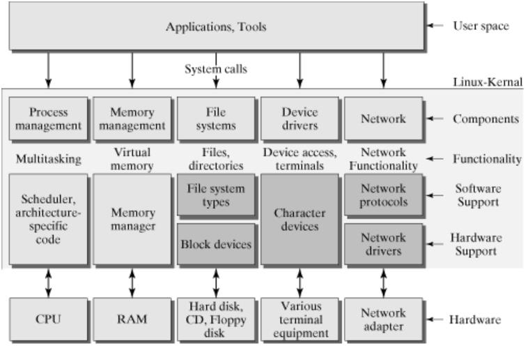

# 面试 Linux基础

## 1. 用户态和内核态

Linux整个体系可以分为**用户态**和**内核态**。**内核态**是Linux内核程序运行的空间，Linux内核用于协调CPU、内存、文件等计算机硬件资源，为上层的应用程序提供支持和服务；**用户态**是构建在内核态基础之上的运行空间，服务于应用程序的运行，在用户态状态下只能受限地访问内存，且无法访问外围设备，不具备占用CPU的能力。**系统调用**构建了从用户态到内核态的桥梁，应用程序可以通过系统调用的方式获取系统的资源，从用户态转换为内核态。Linux系统架构图如下所示。此处参考[这里](https://blog.csdn.net/JMW1407/article/details/107901155)

内核实现的功能主要包括：进程管理、内存管理、文件管理、设备管理、网络资源管理。处于用户态的程序可以通过三种方式访问内核态资源：**系统调用**、**库函数**、**Shell脚本**。

**1. 系统调用**
系统调用是操作系统的最小功能单位，

**2. 库函数**
由于系统调用的属于操作系统的最小功能单位，因此实现一个操作可能需要同时调用多个系统调用才能实现。为了屏蔽实现细节降低操作的复杂度，使用库函数对系统调用进行封装，提供相对简单易用的接口给用户用于内核态操作。
常用的库函数：malloc()，malloc函数调用sbrk()系统调用以分配内存；print()，print函数调用write系统调用以输出字符串等等。

**3. Shell脚本**
Shell是一个特殊的引用程序，其本质是一个命令解释器，用于在系统调用和用户、上层应用之间进行操作和数据的传递。

**用户态和内核态的切换**
处于用户态的进程可访问的资源受限制较大，当需要一些系统资源时，进程会从用户态切换至内核态，调用对应的系统调用，系统调用完成操作后，再切换为用户态。进程每进行一次系统调用都会完成一次用户态-内核态-用户态的周期转换。
除系统调用外，**异常**和**外设中断(硬中断)**也会导致用户切换至内核态。例如，当CPU正在执行处于用户态的进程时发生缺页异常，系统会将进程切换为内核态，以处理相关的异常。

## 2. 内存管理和访问

页表、快表

## 3. namespace和cgroup

参考[这里](https://zhuanlan.zhihu.com/p/391525180)

### 4. 四种I/O模型？

Linux下，进程从外部设备读取数据需要经历三个步骤：① 进程发起read系统调用；② 内核将数据从文件(磁盘、网卡)读取到内核缓冲区; ③ 将数据从内核缓冲区复制到进程的用户内存中，完成一次I/O。这个过程涉及CPU、内存和外部设备等运行速度差异巨大的设备，因此使用I/O模型协调保证程序的高效运作。

四种主要的I/O模型：同步阻塞BIO、同步非阻塞NIO、IO多路复用、异步AIO。

**同步阻塞IO (Blocking IO)**
最常规的IO模型。系统接收到连接后，建立一个线程处理连接，线程从用户空间向内核空间发起IO请求，等待内核完成IO操作后，程序从用户空间获取数据继续进行操作。程序从发起IO开始到系统调用返回，这期间都处于阻塞状态。

优点：① 程序简单；② 阻塞期间程序挂起，不占用CPU资源。
缺点：① 为每一个连接都建立线程，系统资源开销大。

**同步非阻塞IO (Non-Blocking IO)**
与BIO相似，系统接收到连接后，建立线程并发起系统调用，但区别在于程序不需要阻塞以等待内核完成IO操作。线程发起系统调用后，系统调用会立即返回一个状态标志，若IO操作未完成则返回失败，线程继续轮询；若IO完成则返回成功，此时阻塞线程，等待数据由内核区复制至线程的用户内存中，完成后线程唤醒。
注：非阻塞是指发起IO的系统调用后不阻塞，采用轮询的方式查询IO结果，最后的数据赋值同样需要阻塞。

优点：发起IO系统调用后线程不阻塞。
缺点：不断轮询，CPU占用高，效率低下。

**IO多路复用 (IO Multiplexing)**
为了避免NIO中轮询占用CPU时间片的问题，使用IO多路复用。**多路**指多个连接，**复用**指复用一个线程。当系统收到客户端连接后，不再创建线程处理连接，而使用一个固有的线程处理，该线程使用select(poll或epoll)系统调用发起IO请求，通过select可以实现一个线程监控多个连接(文件描述符)，当某个连接的数据在内核中准备就绪后，固有线程将该数据通过连接回传至客户端。

优点：① 不新建线程，降低资源开销；② 线程不阻塞；
缺点：① 实现相对复杂；

**异步IO (Asynchronous IO)**
用户线程通过系统调用发起I/O操作后，向内核注册一个I/O事件，当整个I/O操作完成后(包括数据复制)，通过I/O事件告知用户线程进行后续的业务操作。用户线程发起I/O操作后可以继续做别的事，在整个过程中用户线程不会被阻塞。

优点：① 真正的异步操作，等待数据和复制数据两个阶段都不存在阻塞，数据吞吐量高于IO多路复用；
缺点：① 需要系统内核支持；

### 4. Linux下select、poll、epoll的区别？

select、poll和epoll是Linux系统下的三个系统调用，也是IO多路复用实现的基础。Linux下，所有I/O设备都被抽象为了文件，因此Linux使用文件描述符确定socket连接。参考[这里](https://zhuanlan.zhihu.com/p/367591714)。

**多路复用**
多路：多个socket网络连接。
复用：复用一个线程来检查多个文件描述符(socket)的状态。
多路复用的三种方式：select、poll、epoll，epoll为最新也是目前最优的一种I/O多路复用实现方式。

I/O多路复用就是通过一种机制，一个进程可以监视多个描述符。一旦某个描述符就绪（一般是读就绪或者写就绪），能够通知程序进行相应的读写操作。但select，poll，epoll本质上都是同步I/O，因为他们都需要在读写事件就绪后自己负责进行读写，也就是说这个读写过程是阻塞的，而异步I/O则无需自己负责进行读写，异步I/O的实现会负责把数据从内核拷贝到用户空间。

**Select**
select系统调用可以监视3中文件描述符：writefds、readfds、exceptfds。
① 进程调用select时，会将需要监控的readfds集合复制到内核中，并阻塞进程。
② 内核负责遍历对应的readfds集合，此时I/O开始完成数据交换。
③ 当集合中有readfds就绪时，内核唤醒进程，进程遍历全部监控的文件描述符，选取就绪者进行数据处理。

select存在的问题：
① **复制**：每次调用都需要复制文件描述符集合，高并发下资源开销大。
② **端口有限**：能监听的端口有限，fds_bits数组的总比特位数定义了监听端口的上限，其默认为32个int类型长度的bit位，32位系统为32×32，即1024个端口，64位系统为32×64，即2048个端口。
③ **遍历**：进程每次被唤醒都需要遍历全部监控的socket。

**Poll**
poll和select高度相似，区别在于poll使用了pollfd列表结构取代select中的集合来存储文件描述符，使poll支持监控的端口远大于1024。但poll依然存在大量内存复制和个别socket就绪需要遍历全部监听socket的问题。

**Epoll**
Linux2.6内核中出现了epoll取代select和poll，实现了更高效的I/O。epoll操作涉及到三个数据结构：wq等待队列、rbr红黑树、rdllist就绪链表。
等待队列：存储需要I/O的进程。当进程需要I/O时，阻塞后放入队列，有就绪socket以后出队列进行I/O。
红黑树：用于存储监控的文件描述符(socket)，取代select的集合和poll的polldf列表。
就绪链表：用于存储就绪的文件描述符以返回给进程，避免了遍历红黑树。

epoll的优点：
① 文件描述符就绪时，从等待队列唤醒进程，读取就绪链表，无需遍历红黑树。
② 首次调用epoll时进行文件描述符复制，之后epoll不再需要拷贝。

### 5. 进程调度算法有哪些？

**FCFS先来先服务算法**
最简单的一种调度算法，按照进程到达的先后顺序分配CPU的时间片，先到的进程先完成，后到的进程后完成。该调度算法**不可抢占**。

**SJF短作业(进程)优先算法**
为了提高系统的吞吐量，可以使用SJF算法。较短的作业(进程)可以优先获取CPU时间片，拿到时间片后会一直运行直至完成，该调度算法**不可抢占**。这种算法有可能造成长作业(进程)饥饿。

**优先级调度算法**
依照进程的优先级对进程进行调度，优先级较高的进程可以抢占优先级较低的进程的CPU时间片，相同优先级的进程按照FCFS的方式获取CPU时间片。该算法**可抢占**。

**高响应比优先调度算法(作业调度)**
主要用于作业调度，是对FCFS调度算法和SJF调度算法的一种综合平衡，同时考虑了每个作业的等待时间和估计的运行时间。响应比越高越容易获取CPU时间片。
响应比计算公式：$ 响应比Rp = \frac{等待时间 + 要求服务时间}{要求服务时间} $
特性：
① 等待时间相同，作业越短，响应比越高，类似SJF短作业优先。
② 作业长度相同，等待时间越久响应比越高，类似FCFS先来先服务。
③ 长作业等待较长时间响应比也会较高，避免饥饿。

**时间片轮转调度算法**
时间片轮转算法主要用于分时系统，其遵循FCFS先来先服务的原则将所有进程放入一个队列中，为队头进程分配相同的时间片，时间片完成后若进程仍未执行完毕，将其重新放回队尾，等待再次调度。

**多级反馈队列调度算法**
多级反馈队列调度算法是时间片轮转算法和优先级调度算法的综合与发展。在时间片轮转的基础上，使用多个优先级不同的队列放置不同长度的进程，第一个队列优先级最高，CPU时间片最短，接下来的队列优先级递减，CPU时间片递增，队列内按照FCFS进行调度。
优势：
① 终端型作业用户：短作业优先
② 短批处理作业用户：周转时间较短
③ 长批处理作业用户：经过前面几个队列得到部分执行，不会饿死。

