# 面试: 数据库问题

## 一、非关系型数据库 NoSQL:

##### Redis(Remote Dictionary Server)是一个使用C语言实现的，高性能非关系型的数值对数据库。Redis中的数据是存储在内存中的，因此读写速度较快。Redis官方性能测试报告[地址](https://redis.io/docs/management/optimization/benchmarks/)。

**Redis的优缺点**
优点：
1 **基于内存操作**，内存读写速度快。
2 **支持多种数据类型**，包括String、Hash、List、Set、ZSet等。
3 **支持持久化**，包括RDB和AOF两种持久化机制。
4 **支持事务**，Redis所有操作都是原子性的，且支持操作合并后的原子性执行。
5 **支持主从复制**，可以实现读写分离。
6 Redis命令处理为**单线程**。
缺点：
1 结构化查询支持较差。
2 数据库容量受物理内存限制，容量通常较小。
3 Redis对在线扩容支持较差。

### 1. Redis支持哪些数据类型？

Redis支持五种常用的数据类型和三种特数的数据类型。其中五种常用数据类型包括：**String字符串**、**Hash哈希表**、**List列表**、**Set集合**、**ZSet有序集合**。三种特殊数据类型包括：**BitMap位图**、**HyperLogLog**、**geospatial地理位置**。

**String 字符串**
Redis中的字符串是字节序列，其为二进制安全的，可以包含任何数据，诸如图片或序列化对象。String的长度最大上限为512M。Redis的key就由String存储，而value可以由redis支持的任意数据类型实现。

Redis的String基于**SDS(Simple Dynamic String)**简单动态字符串实现，通过保存字符串的长度读取完整的字符串，避免C语言读取包含空格的字符串时的字符串截取问题，保证了二进制安全。SDS有5种不同的具体实现，分别为：sdshdr5、sdshdr8、sdshdr16、sdshdr32、sdshdr64，这五种SDS实现的具体差异主要在于记录len和alloc字段的类型不同，表达的buf长度范围也不同，sdshdr5占用空间最小，表示buf的长度也最小，sdshdr64占用空间最大，表示buf的长度也最大(512M)。出于节约内存空间的考量，Redis依据需要存储的字符串的实际长度选择对应的大小SDS实现存储String，因此被称为SDS简单动态字符串。

**SDS**结构体包含四个字段：

> buf[]: 字符数组、真正存储的字符串
> len: 当前buf数组中存储的字符串的长度
> alloc: buf数组能够存储的最长的字符串
> flags: 表示SDS的类型

字符串通过set和get命令即可实现存储和读取，此外Redis种的字符串还可以作为整型变量进行增加操作。

```shell
# 存储key：name，value：lalala
127.0.0.1:6379> set name lalala
OK
# 读取key：name
127.0.0.1:6379> get name
"lalala"

# 存储key：num，value：10
127.0.0.1:6379> set num 10
OK
# 加一操作
127.0.0.1:6379> incr num
(integer) 11
127.0.0.1:6379> get num
"11"
# 减一操作
127.0.0.1:6379> decr num
(integer) 10
127.0.0.1:6379> get num
"10"

# 设置过期时间30秒
127.0.0.1:6379> setex name 30 hello
OK
# 查看剩余过期时间
127.0.0.1:6379> ttl name
(integer) 20

# 同时设置多个key-value
127.0.0.1:6379> mset k1 v1 k2 v2 k3 v3
OK
# 同时获取多个key的value
127.0.0.1:6379> mget k1 k2 k3
1)"v1"
2)"v2"
3)"v3"
```


**Hash哈希表**

Redis中的Hash是一个哈希散列表，其key为字符串，value为一个存储field-value对的集合。Redis的哈希类型适用于存储对象。Redis中每个hash对象最多可以存储$2^{23}-1$个键值对。

```shell
# 一次性存储一个person对象的多个field的值
# 命令结构：hmset key field1 value1 field2 value2 field3 value3 ...
127.0.0.1:6379> hmset person1 name lalala age 23 gender male
OK
# 读取person对象的字段
127.0.0.1:6379> hget person1 name
"lalala"
```

哈希表通过拉链法解决冲突，当冲突过多后，查询速率会退化至O(n)，通过扩容和rehash可以解决这个问题。

渐进式rehash
哈希表的rehash操作分为两种：扩展和收缩，当负载因子大于等于1时(若执行持久化时，大于等于5)，执行扩展操作；当负载因子小于0.1时，执行收缩操作。
Redis的哈希表中维护了两个HashTable，ht[0]用于存储数值，ht[1]用于再哈希。触发再哈希时，将ht[0]中的K-V对放入ht[1]中，再将ht[0]置为ht[1]，将ht[1]置为空，结束再哈希过程。整个再哈希过程不是一次性完成的，是分多次渐进完成的。通过渐进式再哈希，可以避免一次性操作带来的服务停滞，消除阻塞。
渐进式rehash步骤：
① 为ht[1]分配新的空间，若扩容则容量<<1(×2)，缩容容量>>1(/2);
② 在字典中维护一个索引计数器rehashidx，设置初始值为0，表示rehash正式开始。
③ 在rehash期间，除了执行hset(hmset)、hdel、hget操作外，还会将ht[0]上的table[rehashidx]的所有元素再哈希至ht[1]上，并将rehashidx+1。
④ 不断执行③操作，最后当rehashidx等于ht[0]的table长度时，即完成了rehash过程。ht[0]中所有数据都在ht[1]中。将rehashidx置为-1，释放ht[0]，将ht[0]赋值为ht[1]，将ht[1]置为空，等待下一次rehash操作。

在rehash的过程中，更新、查找和删除操作都需要同时在ht[0]和ht[1]中执行。新增操作仅在ht[1]中执行。


**List列表**

Redis中的列表是字符串列表，按照插入顺序排序，可以选择插入一个元素至列表的表头或表尾。Redis的列表实由快速列表实现(压缩列表+双向链表)，对于两端的操作性能较高，对于随机索引查询元素的性能较低。List结构通常用于**消息队列**(lpush+rpop)、**栈**(lpush+lpop)。

```shell
# 从左边插入元素
127.0.0.1:6379> lpush lst java
127.0.0.1:6379> lpush lst C++
127.0.0.1:6379> lpush lst C
# 从右边插入元素
127.0.0.1:6379> rpush lst python
127.0.0.1:6379> rpush lst go
# 从左边移除元素
127.0.0.1:6379> lpop lst
C
127.0.0.1:6379> lpop lst
C++
# 从右边移除元素
127.0.0.1:6379> rpop lst
go

# 查询列表的实现方式
127.0.0.1:6379> object encoding lst
quicklist
```

>  QuickList快速列表

快速列表是由压缩列表和双向链表构成的数据结构，快速列表总体上是一个**双向链表**，提供高效的两端操作，快速列表的节点是**压缩列表**，区别于元素等长的普通列表List，压缩列表ZipList每个节点的大小都按需分配，规避了List内存对齐浪费空间的问题。

**双向链表**的优势是节点的修改效率高，对单个节点的修改不影响其他节点，但需要额外的空间存储指针，且当节点较多时会产生大量内存碎片，不利于内存管理。
**压缩列表**的优势在于内存连续紧凑，不存在内存碎片，且额外消耗的空间较少，但更新效率低，需要修改需要进行内存复制。
为了结合二者的优点，尽量缓解缺陷，Redis融合了二者的特性构造了快速列表。以下是快速列表的逻辑结构：


快速列表是双向链表和压缩列表权衡的结果，其存在两种极端情况导致性能退化：
① 若其中压缩列表长度太长，而双向链表节点较少，快速列表会退化为压缩列表，难以进行空间分配，且更新操作需要进行大量的内存复制。
② 若其中压缩列表长度太短，双向链表节点较多，快速列表退化为双向链表，内存极具碎片化，且利用率降低。
为了保证快速列表不出现上述极端情况，Redis采用list-max-ziplist-size参数控制ZipList长度，以维持快速列表不会退化。list-max-ziplist-size参数取值如下：
正数：按照正数的值限定每个ZipList上节点的个数。例，取10时，一个ZipList的节点最多不超过10个。
-1：QuickList节点上的ZipList大小不超过4K，若要超过则新增一个QuickList节点存储新的ZipList。
-2：QuickList节点上的ZipList大小不超过8K。
-3：QuickList节点上的ZipList大小不超过16K。
-4：QuickList节点上的ZipList大小不超过32K。
-5：QuickList节点上的ZipList大小不超过64K。																						

由于通常list两端的数据访问频率较高，而中间的数据被访问频率较低。因此为了进一步节省空间，Redis中的QuickList可以对中间节点的ZipList进行LZF压缩，使用list-compress-depth设置压缩深度，即两端不被压缩的节点的个数，当取值为0时，表示全部节点都不压缩，Redis默认设置为0。

> ZipList压缩列表

压缩列表是Redis为了节省存储空间构造的一种连续存储数据结构，符合列表的连续特性，且更节省空间。压缩列表遍历时根据**zltail**跳转至表尾，从后向前依据节点保存的前一个节点的长度进行逆向遍历。压缩列表的逻辑结构如下所示：

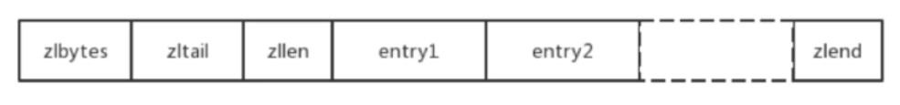

**zlvytes**：4字节，表示压缩列表的字节长度，因此压缩列表最大长度为$2^{32}-1$字节。
**zltail**：4字节，表示压缩表尾相对于压缩表头的相对偏移量。
**zllen**：2字节，表示压缩表的实际存储的节点个数，因此压缩表最多存储$2^{16}-1$个节点。
**entry**：压缩列表的节点，其内部包含3个属性，分别存储上一节点长度、本节点类型和本节点数据。
**zlend**：1字节，0xff，表示压缩列表的结尾。

压缩列表的节点结构如下所示，一个节点包含三个部分，分别为previous_entry_length、encoding和content。

| previous_entry_length | encoding               | content            |
| --------------------- | ---------------------- | ------------------ |
| 前一个节点长度        | 当前节点内容的编码方式 | 当前节点的数据内容 |

**previous_entry_length**：记录前一个节点的长度，长度为1字节或5字节，当前一个节点长度小于254字节时，该属性长1字节，当前一个节点长度大于等于255时，该属性长度变为5字节，第一个字节设置为254(0xfe)，后四个字节保存前一个节点的长度。
**encoding**：记录content的类型和长度，其长度可以为1字节、2字节、5字节。当content存储整数时，encoding长为1字节，首两位为11，后6位记录content的长度；当content存储字节数组(字符串)时，encoding长度随content长度变化而变化，content长度小于64时，encoding占一个字节，编码首两位为00，后6为记录字符串实际长度；content长度小于等于64小于$2^{14}-1$时，encoding占两个字节，首两位为01，后14位记录content长度；content长度小于等于$2^{32}-1$时，encoding占五个字节，首两位为10，后6位作内存对齐，剩余4个字节记录content长度。注：ZipList最大长度即为$2^{32}-1$字节。
**content**：记录节点内容，其类型由encoding属性决定。

**级联更新**
由于压缩列表节点存储上一个节点长度且previous_entry_length属性长度可变(1或5)的特性，有可能出现$e_{i-1}$节点更新后长度超过255，则$e_i$节点的previous_entry_length属性长度由1变为5，若$e_i$节点的长度原本就在250至254之间，则$e_{i+1}$节点的previous_entry_length属性也需要由1变为5，以此类推出现连续更新。由于每次更新需要对整个压缩列表重新分配内存，其时间复杂度为**O(N)**，若压缩列表中有大量连续的甚至所有的节点长度均在250至255之间，则会出现级联更新，时间复杂度为**O($N^2$)**。
即使存在级联更新，也不影响使用，因为出现大量连续且长度在250-254之间的节点概率较低，而对于少量节点的级联更新对性能影响不大。

**ZipList的特征**
结构紧凑：一整块连续的内存空间，没有碎片，更新节点内容会导致realloc和内存复制，时间复杂度为O(N)。
逆向遍历：在压缩列表内的遍历方向为逆序，从列表尾部至列表头。
级联更新：当前一个节点的长度变化导致当前节点的previous_entry_length属性变化后，会出现级联更新的情况，时间复杂度降低为O($N^2$)。


**Set集合**

Redis的Set是String类型的无序集合，其内部数据结构通过哈希表实现，添加、删除、查找操作的时间复杂度都为**O(1)**。对集合可以取并集、交集和差集操作。Set集合可以用于收集共同关注、共同爱好等场景。

```shell
# 添加元素到color集合中
127.0.0.1:6379> sadd color red
127.0.0.1:6379> sadd color green
127.0.0.1:6379> sadd color blue
# 返回集合color中的元素个数
127.0.0.1:6379> scard color
(integer) 3
# 返回集合中的所有元素
127.0.0.1:6379> smembers color
1) "red"
2) "green"
3) "blue"
# 判断black是否在color集合中
127.0.0.1:6379> sismember color black
(integer) 0
127.0.0.1:6379> sismember color red
(integer) 1
# 移除元素black，成功返回1，失败或元素不存在则返回0
127.0.0.1:6379> srem color black
(integer) 0

# 添加元素到mycolor集合中
127.0.0.1:6379> sadd mycolor red
127.0.0.1:6379> sadd mycolor blue
127.0.0.1:6379> sadd mycolor pink
# 求集合color中不在集合mycolor中的元素(差集)
127.0.0.1:6379> sdiff color mycolor
1) "green"
# 求集合color和集合mycolor的交集
127.0.0.1:6379> sinter color mycolor
1) "blue"
2) "red"
# 求集合color和集合mycolor的并集
127.0.0.1:6379> sunion color mycolor
1) "blue"
2) "red"
3) "green"
4) "pink"
```


**ZSet 有序集合**

Redis的ZSet和Set类似，都为集合且元素不重复，区别在于ZSet每个元素对应于一个double类型的score，Redis通过score为集合中的成员进行从小到大的排序。ZSet成员变量不重复，但其score可以重复。
ZSet的低层数据结构通过**ZipList压缩列表**和**SkipList跳表**实现。

> SkipList跳表

跳表是一种插入、搜索和删除都是$O(\log n)$的数据结构，其最大的优点是原理简单，容易实现、方便扩展、效率高。在Redis和LevelDB中用代替平衡树(AVL Tree)。此处参考[这里](https://lotabout.me/2018/skip-list/)和[这里](https://zhuanlan.zhihu.com/p/186264574)。

**跳表的基本思想**
跳表是基于有序链表优化而来的数据结构，普通链表查找和插入都需要遍历链表，复杂度为$O(n)$。通过引入索引的方式，可以优化查找的时间复杂度。例如，存储整型的顺序链表中，对偶数个节点建立索引，查找时先顺序跳跃查找，仅遍历索引节点，若找到直接返回，若超过目标节点仍未找到，则从前一个索引开始不再跳跃顺序查找，直到找到或返回空。

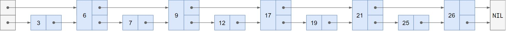

这样查找的时间复杂度降低为$O(\frac{n}{2})$，这是仅建立了一层索引的情况，当建立多层索引，查找的时间复杂度将进一步降低，最后变为$O(\log n)$。其中除了最底层需要顺序查找，其他每一层都是跳跃查找，因此这种数据结构被称之为跳表。

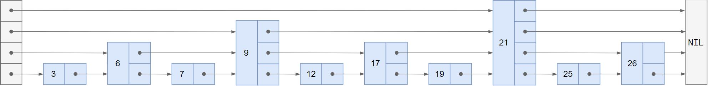

如上图，建立了4层索引，当搜索25时，遍历第一层直接从21开始，21之前所有的数全部跳过，直到最后没有找到；于是从21开始遍历第二层，直到最后还是没有找到；遍历第三层，找到26，超过25；返回21从第四层顺序查找，最后找到25。可以看到这种建立索引跳跃遍历的方式能够越过大量的非必须节点，因此非常高效。

**跳表的索引**
上述的索引是静态的，在多次插入和删除后，由于索引的偏移会降低索引效率，因此在Redis中为了保证搜索效率，在插入节点时使用随机数的方式决定当前节点构建的索引层数，其为代码如下：

```
randomLevel(p)
    lvl = 1
    // random() 返回范围在[0...1)区间内的数
    while random() < p and lvl < MaxLevel do
        lvl = lvl + 1
    return lvl
```

类似于抛硬币，当p设为0.5时，可以认为抛到正面层数+1，直到抛出反面为止。MaxLevel设置索引层数的上限，Redis中索引最高为64层。

**跳表的更新**
Redis中跳表的节点是一个Key-Value键值对，使用Score作为Key，并且按照Key进行索引排序。当更新节点时，如果涉及到score的改变，Redis会直接删除这个节点，然后再重新插入，保证score索引的有序。

```shell
# 插入元素
127.0.0.1:6379> zadd name 10 zhangsan
(integer) 1
127.0.0.1:6379> zadd name 10.1 lisi
(integer) 1
127.0.0.1:6379> zadd name 9.9 wangwu
(integer) 1
# 获取所有元素，按照score的升序输出
127.0.0.1:6379> zrange name 0 -1 
1) "wangwu"
2) "zhangsan"
3) "lisi"
# 获取第一个和第二个元素的value
127.0.0.1:6379> zrange name 0 1
1) "wangwu"
2) "zhangsan"
# 添加score为10的元素
127.0.0.1:6379> zadd name 10 tianqi    
(integer) 1
# key相等则按照value字典排序输出
127.0.0.1:6379> zrange name 0 2
1) "wangwu"
2) "tianqi"
3) "zhangsan"
# WITHSCORES 输出权重
127.0.0.1:6379> zrange name 0 -1 WITHSCORES
1) "wangwu"
2) "9.9000000000000004"
3) "tianqi"
4) "10"
5) "zhangsan"
6) "10"
7) "lisi"
8) "10.1"
```


### 2. Redis为什么快？从内存、IO多路复用、数据结构方面考虑？

**内存**
Redis是基于内存的数据库，所有的操作(持久化除外)都基于内存，因此速度很快。

**单线程**
Redis的线程模型为单线程，在操作的过程中不需要进行CPU上下文切换，避免了线程切换的开销；同时单线程避免了数据同步的问题，没有加锁解锁操作带来的性能开销。

**IO多路复用**
Redis使用一种非阻塞I/O的方式响应外部的请求。所谓的I/O多路复用，复用的是Redis的Redis使用一个**I/O多路复用程序**来接收套接字发送的请求，当接收到请求后，将请求转换为对应的事件放到一个队列中，Redis使用一个**文件事件分派器**处理队列中事件，每获取一个事件，调用对应的事件处理器执行请求。

**NoSQL结构**
Redis是非关系型数据库，其不需要维护关系型数据库的数据之间的映射关联，仅存在K-V的映射方式，因此查询简单。

**数据结构**
Redis使用了SDS、快速列表、压缩列表、跳表等数据结构，优化了数据的操作效率。


### 3. Redis怎么实现消息队列？

Redis实现消息队列有四种方式：**List**、**ZSet**、**订阅者发布者模式**、**Stream**。

**List实现消息队列**
使用List实现消息队列的方式最为简单直接，只需要通过Lpush和Rpop进行消息的存储和读取即可实现消息队列。
优点：使用List实现消息队列方式简单，且可以利用Redis的持久化功能，将消息备份至硬盘。
缺点：消息不支持重复消费；没有主题分类；没有ack确认机制，不可靠类似UDP；可能出现消息堆积。

**ZSet实现消息队列**
与使用List实现消息队列方式类似，利用Zadd和Zrangebyscore实现存储和读取消息，由于ZSet支持score排序，因此可以基于此实现延迟消息队列和优先级队列。
优点：使用简单，具备持久化功能，能实现score排序。
缺点：消息不支持重复消费，且消息内容不能重复，没有ack确认机制；可能出现消息堆积。

**发布者订阅者模式**
以上实现的消息队列模型都属于P2P模型，这种模型功能相对单一。Redis支持使用Publisher（发布者）和 Subscriber（订阅者）来实现消息分发，可以支持消息主题分类和消息一对多机制。订阅者发布者模式本质上是维护了发布者和订阅者之间的TCP长连接，发布消息时直接发送数据，不考虑存储，因此不会出现消息积压问题。此处参考[这里](https://blog.csdn.net/w15558056319/article/details/121490953)和[这里](https://blog.csdn.net/printf88/article/details/123377831)。
"发布/订阅"模式包含两种角色，分别是发布者和订阅者。订阅者可以订阅一个或者多个频道(channel)，而发布者可以向指定的频道(channel)发送消息，所有订阅此频道的订阅者都会收到此消息。Redis提供两种信息机制，分别为发布/订阅**Channel**和发布/订阅**Pattern**。
**频道Channel**
频道是Redis中以String类型为名的消息通道，发布者通过publish命令向Channel中放入消息后，任何订阅了Channel的订阅者都能够接收到消息通知。
Redis使用字典+链表的方式存储频道及其订阅者，字典的key即为频道的名称，value为一个链表，存储了这个频道的订阅者信息。当发布者向频道A发布消息时，Redis根据频道名称A从字典中获取A的全部订阅者，并向其转发消息。频道的结构如下所示。
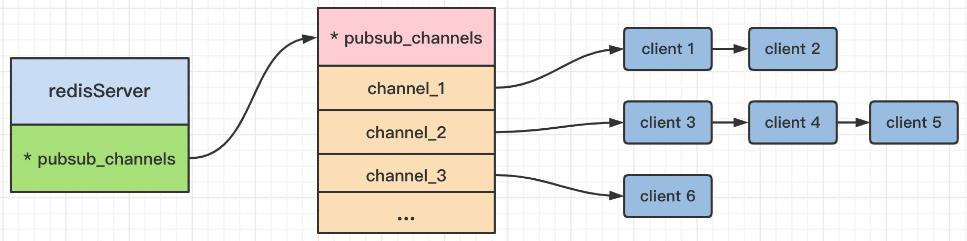

**模式Pattern**
Redis使用Pattern为订阅者提供一个订阅多个Channel的方式，模式能够以类似正则化的方式匹配多个频道，当订阅者使用psubscribe命令以模式方式订阅频道时，Redis解析订阅者给出的模式，锚定所有可以和对应模式匹配的频道，这样订阅者可以同时接收多个频道传来的消息。
Redis使用字典存储订阅者和模式的匹配关系，链表的每个节点保存了一个模式及其订阅者。当发布者向频道A发布消息时，Redis获取模式链表，遍历链表全部节点查找持有与频道A匹配的模式的订阅者，并向该订阅者发布消息。模式的存储结构如下图所示。
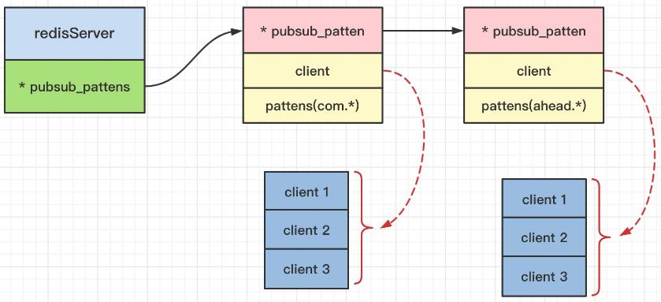

优点：消息可以被多个订阅者消费，解决了一对多的问题，任意关注了对应频道的订阅者都能获得消息；支持主题分类；
缺点：没有持久化机制，订阅者掉线重连后信息丢失；没有ack确认机制，不可靠；

**Stream实现消息队列**
Redis5.0版本后添加**Stream**数据结构，用于提供消息持久化和主备份复制功能，让任何客户端访问任何时刻的数据，并且能记录每个客户端的访问位置，保证消息不丢失。Stream的实现是一个不断从尾部添加消息的链表，将所有的消息都串联起来，每一个消息都有一个唯一的ID。Stream头部的消息不会被自动丢弃，消费者读取消息的时候仅向后移动指针，因此可以回溯之前的消息，防止消息漏传。Stream支持持久化，配合非自动丢弃的机制可以保证信息不丢失。


### 4. 讲讲Redis集群？

Redis的集群方式包括三种：主从模式、哨兵模式、集群模式。

#### 主从模式

主从模式的核心思想是**主从复制**，将集群中的一类节点作为主节点，用于接收读写操作，剩余节点作为从节点，仅用于接收读操作。当主节点的数据变化时，自动同步给从节点，以此达到数据的一致性。通常一个主节点可以拥有多个从节点，一个从节点只能拥有一个主节点。

**数据同步**
主从模式下，数据同步分类两种情况：**全量同步**和**增量同步**。**全量同步**通常用于从节点初始化阶段，将主节点中的全部数据以RDB的方式同步至从节点；**增量同步**通常用于主节点将部分修改后的数据同步至从节点，将写命令从主节点发送至从节点实现同步。
数据同步的全流程如下：
① 从节点启动后向主节点发起SYNC同步请求。
② 主节点接收SYNC同步请求后，执行bgsave，生成RDB文件，并使用缓存记录此后的写指令，用于补齐生成RDB文件过程中的数据变化。
③ 主节点将RDB发送至从节点，从节点接收RDB快照文件，并初始化本地数据库。主节点不会主动询问从节点是否同步成功，但会进行心跳检测保持连接。从节点完成同步后主动向主节点发送ACK确认。
④ 主节点发送RDB文件后，向从节点发送缓存记录的写指令，从节点接收写指令后进一步更新数据库，完成整个同步过程。
⑤ 后续仅需要继续进行增量同步，即可保持主从节点的数据一致性。

**主从模式的优点**
支持主从复制和自动同步
支持读写分离，读请求使用从节点响应，缓解主节点压力。
从节点可以接受其他从节点的同步请求，可以分担主节点的同步压力。
主从节点都以非阻塞的方式进行数据同步，如果有客户端提交请求，则返回同步前的数据。

**主从模式的缺点**
不支持自动纠错和自动恢复的功能，主节点宕机会导致写请求失效，需要等待重启或人工切换主节点。
主节点宕机会导致上一次备份至宕机期间的数据修改丢失。
多个从节点同时重启会导致主节点同时接收到多个SYNC同步请求，IO压力骤增，降低主节点吞吐量甚至宕机。
主从模式难以在线扩容。


#### Sentinel哨兵模式

哨兵模式在主从模式的基础上增加了哨兵进程进行节点监控，当主节点宕机后，哨兵模式下可以实现从节点自动升级为主节点。

**哨兵进程**
哨兵模式的实现依赖于哨兵进程，哨兵进程是独立于数据操作的单独进程，通过间断向所有节点发送消息并等待响应的方式，监控各个节点的状态。当哨兵进程检测到主节点宕机后，会将从节点升级为主节点，再通知其余从节点更新配置信息，切换主节点。
哨兵模式支持多个哨兵进程对节点进行监控，也支持哨兵节点相互监控，保证系统的健壮性。

**节点切换**
① 每个哨兵都会以每秒一次的频率向全部实例发送Ping命令，查看是否在线。
② 若某个实例超过阈值时间(down-after-milliseconds设定值)没有响应Ping，则哨兵判断其为**主观下线**。
③ 若主节点被判定为**主观下线**，则监视该节点所有哨兵进程以每秒一次的频率向其他哨兵确认该节点进入了主观下线状态。
④ 当有足够数量的哨兵(>=配置文件设置)都判断其为主观下线，则该主节点被标记为**客观下线**。此时，哨兵发起投票从该主节点对应的从节点中择其一升级为主节点，并将该INFO以每秒一次的频率发布至从节点。注：正常情况下，INFO以每10秒一次的频率发布至相关节点。
⑤ 若没有足够数量的哨兵判断其为主观下线，则主节点的客观下线状态会被移除。若主节点重新回复Ping命令，则主节点的主观下线状态会被移除。

**哨兵模式的优点**
具备主从模式的优点
主从可以自动切换，系统可用性更高。

**哨兵模式的缺点**
依旧难以实现在线扩容。
主节点宕机到选择新的节点期间，写服务不可用。


#### Cluster集群模式

主从和哨兵模式下，从节点作为主节点的备份，其数据和主节点完全相同，内存利用率不高。Cluster模式实现了Redis不同节点存储不同的数据，提高了内存利用率。
Cluster集群模式中，集群内的全部Redis都是相互连通的，数据以Partition分片的方式存储于不同的节点上，客户端仅需访问任意一个节点，即可访问全部节点中的数据。

**Cluster数据分片**

Redis的Cluster集群使用**哈希槽(hash slot)**的方式实现数据分片，将全部数据划分为16384($2^{14}$)个哈希槽，将Key使用CRC16校验后与16384取模，决定放置于对应的哈希槽中。分片时，根据集群中节点的个数平分哈希槽，并在每个节点中存储对应哈希槽和节点的映射信息，即可完成不同节点的数据划分。

**Cluster的主从复制**
为了保证高可用，cluster集群引入了主从复制模型，一个主节点对应一个或者多个从节点，当主节点宕机的时候，就会启用从节点。当其它主节点 ping 一个主节点 A 时，若半数以上的主节点与 A 通信超时，那么认为主节点 A 宕机了。如果主节点 A 和它的从节点 A1 都宕机了，那么该集群就无法再提供完整的服务了。

**Cluster模式的优点**
所有节点相互连接，内部使用二进制协议优化传输效率。
节点宕机需要集群中的半数节点的确认才能生效。
客户端与Redis直连，不需要代理，只要和集群中任意节点连接，即可实现全部数据的访问。


### 5. Redis 支持事务吗？

支持。Redis的事务本质上是一组命令的集合，事务的执行过程就是按照顺序串行化执行队列中的命令，任何其他客户端提交的命令都不能插入到事务的执行序列中。

Redis的事务不存在隔离级别的概念；尽管Redis的单条命令执行是原子的，但Redis的事务不保证原子性，且没有回滚，事务中的一条命令执行失败，其余的命令仍会被执行。


### 6. 讲一下缓存穿透、缓存击穿、缓存雪崩？

#### 缓存穿透

缓存穿透指待查询的key不存在，从而缓存失效直接查询数据库。若这样的key恰好并发量大，则会对数据库造成较大的压力。
解决方案：①可以将所有存在的key放入一个set中，查询时先查询key是否存在，若key不存在则直接返回null，若存在则正常查询缓存，若未命中则继续查询数据库。

#### 缓存击穿

在高并发环境下，若大量的请求查询一个key，而此时正好key过期失效了，会导致大量的请求直接涌向数据库，此种现象为缓存击穿。
解决方案：①取消过期时间，key永不过期。②对相同的key添加互斥锁，第一个访问的线程拿到锁后，加锁阻塞其他线程，并将拿到的结果放入缓存，再唤醒其他线程，其他的线程直接从缓存中获取数据。

#### 缓存雪崩

缓存雪崩类似于缓存击穿，当缓存中大量数据过期失效，导致大量请求发送至数据库，导致压力骤增，数据库崩溃。这种现象的主要原因在于缓存集体失效。
解决方案：①将缓存失效时间离散化，尽量将缓存的失效时间间隔开来，采用固定30min+300s内随机时间的方式设置过期值。②使用熔断机制，当请求量到达一定阈值时，直接返回“系统繁忙”提示，不再访问数据库，等待请求量下降时再处理。


### 7. Redis具备持久化机制吗？RDB和AOF如何选择？

Redis具备两种持久化机制：**RDB**和**AOF**

#### RDB(Redis DataBase)

RDB是Redis默认的存储方式，其通过快照(snap-shotting)的方式对某时刻Redis内的数据进行持久化存储，其不关注过程，仅关注数据本身。此处参考[这里](https://zhuanlan.zhihu.com/p/345725544)

**RDB触发规则**
Redis中有四种方式触发RDB过程：触发自定义的快照规则、执行save或bgsave命令、执行flushall命令、执行主从复制命令。此外还可以通过redis.conf文件配置save参数的方式，设置多个条件，满足其一则执行RDB。

```shell
save ""  # 不使用RDB存储
save 900 1  # 15分钟(900秒)，至少一个键被更改则进行快照
save 300 10  # 5分钟(300秒)，至少10个键被更改则进行快照
```

**RDB执行流程**

① 当使用bgsave命令进行非阻塞保存时，主进程首先执行fork(调用OS函数复制主进程)，阻塞主进程以创建子进程，子进程创建完成后主进程继续响应其他请求。
② 子进程创建后，开始创建RDB文件，根据主进程的**内存数据**生成临时快照文件，完成后对原有的RDB文件进行原子性替换。
③ 子进程发送消息给主进程，表示完成，主进程依照子进程更新信息(保证数据一致性)，之后继续运行。

RDB持久化的是**某一时刻**的Redis数据，如果执行持久化的过程中数据被修改，那么会破坏数据一致性；如果在持久化过程中拒绝所有修改请求，那么Redis性能会受到严重影响。为了解决数据一致性和Redis主进程持续响应之间的冲突，Redis使用了**CopyOnWrite写时复制**的机制。
**写时复制**：Redis执行数据持久化时，主进程和子进程共享同一片内存数据，当主进程接收到数据修改的请求之后，执行修改前，先复制一份原始数据备份用于子进程生成快照文件，再对原始数据执行修改操作。如此一来，主进程就可以在快照发生的过程中继续接受数据写入的请求，子进程也仍然能够对某一时刻的内容做快照。

**RDB的优缺点**
优点
① RDB快照文件是二进制压缩文件，占用空间小，便于传输(传给slaver)
② 主进程fork子进程，可以最大化Redis性能
③ 使用RDB文件来恢复数据较快
缺点
① 不保证数据完整性，会丢失最后一次快照以后更改的所有数据
② 父进程在fork子进程的时候如果主进程比较大会阻塞

#### AOF(Append Only File)

AOF是Redis的另一种持久化方式，其本质是使用AOF文件记录所有对数据库进行过的修改命令和参数，以此记录数据库状态。需要恢复数据时，只需按顺序重新执行命令即可使其恢复到原始状态。**AOF**记录数据更新过程，**RDB**记录数据结果。

#### RDB和AOF的对比

① RDB存某个时刻的数据快照，采用二进制压缩存储，AOF存操作命令，采用文本存储。
② RDB性能较高，AOF性能较低。
③ RDB在触发状态会丢失最后一次快照以后修改的数据，AOF默认一秒更新一次，则最多丢失2秒的数据。
④ RDB模式下，Redis主节点不会保存过期键值对，从节点会保存过期键值对，当主节点向从节点同步时再清空过期键值对
⑤ AOF模式下，对过期的Key会加上del命令，当执行AOF重写时，忽略过期的key。


### 8. Redis的key过期策略？

Redis的过期策略：**定期删除** +  **惰性删除**

**定期删除**
定期删除是指Redis默认每个100ms就随机选取一些设置了过期时间的Key，检查是否过期，如果过期就删除。Redis设置了一个单独的字典存放过期的Key，基于贪心策略定期从这个字典检查部分Key是否过期。Redis默认每次随机选择20个Key进行检查和删除操作，若过期比例超过0.25则会再次随机选择20个Key重复操作。
定期删除可能会导致很多过期的key到了时间也没有被删除，这时候需要使用惰性删除。

**惰性删除**
当获取某个Key的时候，Redis会检查这个Key是否已经过期，若已经过期则删除这个Key，并返回空。如果定期删除遗漏了很多key，很多过期的Key也没有被访问，这就需要**内存淘汰**机制避免内存耗尽了。

定期删除是一种集中删除方式，惰性删除是对定期删除的补全，是一种零散的删除方式。


### 9. Redis内存不足怎么办？内存淘汰策略有哪些？

当Redis内存不足时，会使用内存淘汰机制清理内存，Redis有八种不同的内存淘汰策略：
**no-eviction**：不做任何操作，内存不足时写入操作报错，Redis默认为该策略。
**allkeys-random**：在全部Key中，随机选择移除一部分Key。
**allkeys-lru**(最常用)：在全部Key中，移除最近最少使用的Key。
**allkeys-lfu**：在全部Key中，移除某时间段内使用频率最少的Key。
**volatile-random**：在设置了过期时间的Key中，随机选择移除一部分Key。
**volatile-lru**：在设置了过期时间的Key中，移除最近最少使用的Key。
**volatile-lfu**：在设置了过期时间的Key中，移除某时间段内使用频率最少的Key。
**volatile-ttl**：在设置了过期时间的Key中，有较早过期时间的Key优先移除。

#### Redis的内存淘汰算法

**随机算法**
从Key中随机挑选一些进行删除。

**TTL**
从全部设置了过期时间的Key中，获取过期时间最早的一批进行删除。

**LRU算法**
LRU算法，Least Recently Used最近最少使用算法，通常应用于操作系统中的页面置换算法，Redis中用于删除最近最少使用的Key以节省内存空间。
LRU的基本思路：维护一个时间顺序排列的链表，当有数据访问时遍历链表，若表中存在数据，将其重新插入至链表头；若表中无数据，当内存未满时，将其插入至链表头；若表中无数据且内存已满，则删除链表尾节点，将新节点插入链表头。
由于Redis中Key的数量庞大，因此并没有维护队列或链表用于LRU算法。Redis的策略是从所有Key(allkeys)或有过期时间的Key(volatile)随机选取N个(通过maxmemory-samples参数配置N的大小)，对这N个Key进行LRU算法，选择最久没有使用的一个Key进行淘汰，这被称之为**近似LRU算法**。如果请求符合长尾法则，那么近似LRU效果将趋近于实际的LRU算法。

**LFU算法**
LFU算法，Least Frequently Used表示最不经常使用，它根据数据的历史访问频率来淘汰数据，其核心思想为**如果数据过去被访问多次，那么将来被访问的频率也更高**。LFU避免了LRU存在的偶尔访问一次也被误认为热点数据的情况。
LFU算法和LRU算法的思想基本相似，区别在于队列或链表的顺序按照访问频次降序排序。


### 10. 如何保证Redis和MySQL的数据一致性？

这个问题表面上是数据一致性的问题，根本上问题在于**数据一致性**、**系统性能**和**系统复杂度**的选择和取舍。

**方法一： 先更新MySQL，再更新Redis**

问题：
①如果先完成MySQL更新，尚未更新Redis时，进入了新的请求，直接读取Redis会获取到更新前的数据。 
②如果先完成MySQL更新，Redis更新失败，之后所有请求都会读取Redis未更新的数据。
③多线程情况下，Redis和MySQL的分步更新可能会导致Redis和MySQL更新结果出现不一致。

对于问题②的补救方案：
①若Redis更新失败，直接回滚MySQL数据，保证二者一致，但MySQL是主要数据源，代表数据的权威性，因为Redis失败而回滚MySQL并不合理。
②若Redis更新失败，则重试更新，此时需要根据业务需要考虑设置重试次数上限、重试时间间隔等参数。

**方法二：先更新Redis，再更新MySQL**

考虑到Redis更新性能强于MySQL，更新完Redis后，即便MySQL没有更新，新进的请求读取的数据都是Redis中更新后的数据，可以在一定程度上保证前后操作中数据的一致性，较方法一更为合理。
存在的问题：
① 如果更新Redis成功，而MySQL更新失败，此时数据未生效(未持久化)，新到来的请求读取的是Redis中的无效数据。
② 如果Redis更新成功，而MySQL更新失败，且Redis删除无效数据也失败时，同样面临新到的请求读取的都是无效数据的问题。
③ 同样面临多线程情况下的数据覆盖，不同线程操作Redis和MySQL的先后次序不同，导致Redis和MySQL结果不同。

补救方案：
对于问题①，考虑当MySQL更新失败后，立即删除Redis中的无效数据。
对于问题②，考虑删除Redis的无效数据失败后，重试删除操作，并设置重试的时间间隔和重试的次数。

**方法三：先更新MySQL，再删除Redis**

更新MySQL后，不更新Redis，直接删除Redis中的数据，使新到的请求访问MySQL，Redis从MySQL中获取数据，保证数据一致性。这种方案可以避免方法一和方法二中多线程情况下的并发更新错误。
存在的问题：
① 如果先更新MySQL成功，在Redis删除的间隙同样会出现读取到Redis中失效数据的问题。
② 如果先更新MySQL成功，而删除Redis失败，则同样需要面临重试删除的问题。

**方法四：先删除Redis，再更新MySQL**

更新请求来到时，先删除Redis中的数据，再更新MySQL，这样可以避免方法三中的两个问题，只要Redis删除成功，无论MySQL是否成功更新，MySQL都是数据唯一载体，保证数据一致性，同时也不存在多线程并发更新安全性的问题。

但是，Redis的读策略为若Redis中数据不存在，则从MySQL中读取数据，再将数据写入Redis，并返回数据。如此一来，会存在如下问题：
某商品的库存数为10个，用户A购买一件商品时进行库存扣减，因此第一步先删除了Redis中的库存数。这时，用户B查询该商品的库存，发现Redis中并没有该商品的库存，于是从MySQL中读取库存数后，写入到了Redis中（10个)。然后，用户A更新数据库，将库存数从10个扣减为9个。最终，Redis中的库存数是10个，MySQL中的库存数是9个。问题时序图如下所示。

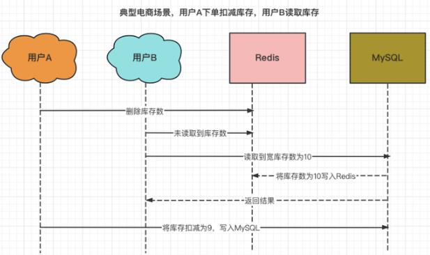

补救措施：
① Binlog同步：将获取MySQL数据写入Redis的操作，改为通过DataBus和Canal同步Binlog的方式，统一更新Redis数据。此方法适用于数据量不大，数据可以完全放入Redis缓存的情况，且需要设置Redis的Key永不过期。因为统一使用log更新，效率较低，Redis命中率低，在数据量大的情况下应用价值不高。

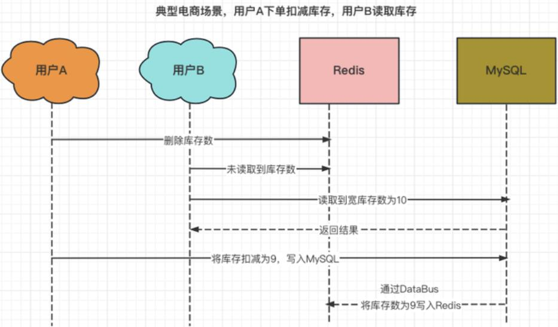

② 延时两次删除：在方法四的基础上最后再次删除Redis。方法四的问题在于用户A修改MySQL后，由于用户B的操作，Redis中存在未修改的失效数据，因此在A用户更新MySQL完成后，删除Redis内的数据，通过降低更新后的命中率，保证数据的一致性。

**方法五：分布式锁**


### 11. Redis如何实现分布式锁？


### 12. Redis中BigKey、HotKey的发现与处理？

**1. BighKey的定义**
通常将含有较大数据体积或含有大量成员的key称之为BigKey，BigKey的具体大小边界根据不同的业务场景和系统架构有不同的定义，针对具体类型来说，大体可以有如下判断：

- 一个**String**类型的Key，其值大小超过5M(较大数据体积)
- 一个**List**类型的Key，其节点数量超过20000个(大量成员)
- 一个**ZSet**类型的Key，成员数量超过10000个(大量成员)
- 一个**Hash**类型的Key，成员数量的value总大小超过100M(较大数据体积)

**2. HotKey的定义**
通常如果某个Key的受访问次数显著高于其它Key时，或对其的操作占用较高的资源时，可以将其称之为HotKey，常见的HotKey情形：

- 单个Redis实例每秒总访问量为10000，而一个Key的访问量为7000(访问次数显著高于其他Key)
- 对于一个拥有上千成员且总大小超过1M的Hash类型，每秒发送大量的HGetAll命令(带宽占用显著较高)
- 对于一个拥有数万成员的ZSet类型，每秒发送大量的ZRange命令(CPU时间显著高于其他Key)

**3. BigKey和HotKey带来的问题**
BigKey及HotKey给Redis带来最常见的问题为性能下降、网络拥塞、数据不均衡、读/写热点问题等。
**性能下降**：Redis为单线程服务，同一时刻仅能处理一个请求，当处理BigKey请求时耗时较长，其他请求会被阻塞，最后导致Redis服务器吞吐量下降甚至请求超时。
**网络拥塞**：请求单个 big keys 产生的网络流量比较大，假设一个 big keys 为 1MB，客户端每秒访问量是 1000，那么每秒产生 1000MB 的流量，普通的千兆网卡承受不了这么大的流量。而且一般会在单机部署多个Redis实例，一个 big keys 可能也会影响其他实例。
**数据不均匀**：Redis 集群模式中，key根据不同的hash嘈分配到不同的节点上，当大部分的 big keys 分布在同一个节点，导致内存倾斜在同一个节点上，内存分布不均。在水平扩容时，需要以最大容量的节为准，浪费内存。

**4. BigKey和HotKey产生的原因**
业务规划规划不足、无效数据堆积、访问突然增加等，例如：
将Redis用于不合适的场景，使用String类型的Key存放大体积二进制文件数据。(BigKey)
在业务层面没有对Key进行合理拆分，造成个别Key中的成员数量过多。(BigKey)
没有对无效数据进行定期清理，如Hash类型不断增加。(BigKey)
预期外的访问量陡增，如爆款商品、热点新闻、直播间活动刷屏、游戏中大量玩家的战斗等。(HotKey)
List类型作为消息队列，消费端离线，生产端持续产生消息，消息大量堆积。(BigKey)

**5. 查找BigKey和HotKey**
使用Redis内置命令debug object命令对Key进行分析。该命令能够根据传入的对象（Key的名称）来对Key进行分析并返回大量数据，其中serializedlength的值为该Key的序列化长度，通过其序列化长度可以推断是否属于BigKey。
需要注意的是，Key的序列化长度并不等同于它在内存空间中的真实长度，此外，debug object属于调试命令，运行代价较大，且由于Redis为单线程，debug命令运行时其他请求会被阻塞，该命令不适用于生产环境实时检测。
也可以使用其他风险更低的方式查看，对于不同的类型，可以使用不同的命令获取其Key对应的Value长度。

|  类型  | 命令   | 时间复杂度 | 返回结果说明 |
| :----: | ------ | ---------- | ------------ |
| String | strlen | O(1)       | 字符串字节数 |
|  List  | hlen   | O(1)       | 列表长度     |
|  Hash  | scard  | O(1)       | 成员数量     |
|  Set   | zcard  | O(1)       | 成员数量     |
|  ZSet  | llen   | O(1)       | 成员数量     |
| Stream | xlen   | O(1)       | 成员数量     |

也可用通过Redis客户端提供的bigkeys参数查找每个类型中的最大的Key，并给出每个类型Key的总数和平均大小。bigkeys是通过扫描数据实现的，最好在slave节点上使用，可以使用--i参数指定扫描速度，如--i 0.1指定每100毫秒扫描一次。

使用Redis客户端提供的hotkeys参数查找HotKey，其返回所有Key的被访问次数，由于返回大量信息，因此分析问题相对比较麻烦。

**6. BigKey和HotKey的处理**

对BigKey而言，可以对其进行异步删除(del直接删除同样耗时，容易造成故障)，使用unlink对BigKey进行异步删除；此外也可以对BigKey进行拆分，例如根据业务实际情况依照属性、日期、类别等信息进行Key拆分。

对HotKey而言，由于迁移粒度问题造成请求无法打散使单一节点的压力无法下降，可以在Redis Cluster中对HotKey进行复制，降低单一节点的压力；如果HotKey的请求类型为读，也可以考虑使用读写分离的架构，增加节点降低单一实例的请求压力。


**LSM树(Log-Structured-Merge-Tree, 日志结构合并树)是一种常用于NoSQL数据库的数据引擎数据结构，HBase、LevelDB、RocksDB以及Prometheus的数据库引擎都基于LSM树。**
**LSM树并不是严格的树结构，它是一种糅合了“磁盘顺序写”、“非原地更新”、“类树状数据结构”、“冷热数据分级”、“定期归并”的设计思想，没有固定的实现方式，其核心为顺序写和非原地更新，不直接对原数据操作而直接以添加修改日志的方式顺序写入修改，以此提升写入效率**。

**LSM树的定义**
LSM是一个横跨内存和磁盘的数据结构，使用level(0-n)划分数据，其中只有level0处于内存中，使用AVL树(或跳表、红黑树等结构)实现有序的数据存储，可以直接进行原地更新操作；磁盘中依照level(1-n)的顺序划分数据集合，每一个level都是一个顺序结构，磁盘中的数据只能读不能原地更新，修改操作只能以**合并**的方式实现。当内存数据结构存满(达到阈值)时，将其顺序刷新到磁盘中，并执行合并操作。若当前level存满则递归地向下一级(i+1)进行合并。每一次合并都是数据压缩的过程。LSM树基本结构如下：

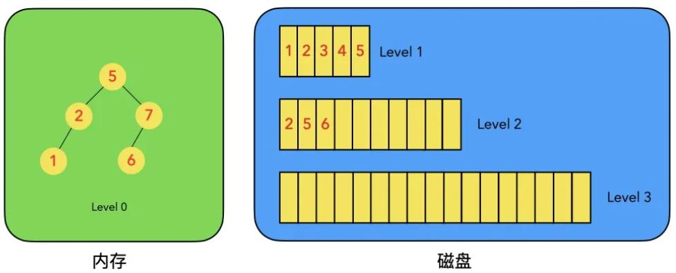

LSM树的特征是以日志的形式添加修改操作，而不是直接对数据进行修改。当对某个数值修改时，直接向level0中添加修改日志即可。

**插入操作**
LSM树的插入相对简单，直接向Level 0的树中放入数据即可，由于Level 0中的数据结构通常为AVL树或红黑树，因此插入操作的时间复杂度为$O(\log{n})$。

**删除操作**
LSM树的删除操作不直接删除数据，其使用**墓碑机制**对需要删除的数据进行标记，删除时对需要删除的数据追加一个墓碑标记即可。将删除操作转换为插入操作，避免了旋转或调整等操作，时间复杂度降低为$O(\log{n})$。
对于待删除数据在内存中的情况，使用墓碑标志标注待删除数据；对于待删除数据在磁盘的情况，直接向Level 0的树中添加墓碑标记即可。

**修改操作**
LSM树的修改操作同样类似于删除操作。对于待修改数据存在于内存(Level 0)中时，直接原地修改数据；若数据存在于磁盘中，LSM并不会直接修改磁盘中的数据，而是直接将新的数据插入到Level 0的树中，等到下次合并时再更新至下一层中。
修改操作本质上也是在对Level 0进行操作，不涉及磁盘修改，Level 0的修改时间复杂度也为$O(\log{n})$。

**查询操作**
LSM树的查询操作会按顺序查找Level 0、Level 1、Level 2 ... Level n，一层未查到再去下一层查找，一旦匹配即返回结果。该策略可以保证查到的结果一定是最新版本的数据。
若数据在内存中，可以在$O(\log{n})$的时间复杂度内查询到数据。
若数据在磁盘中，会先在内存中查询，未查到再到Level 1中顺序查询(磁盘中数据块顺序存储，使用二分法或索引优化)，若仍未查到再依次向下查询，直至返回结果或查完全部数据。对于不存在的数据可以使用布隆过滤器优化查询。

**合并操作**
合并操作是LSM树的核心操作，将内存中的Level 0刷新至磁盘中，也用于对磁盘中的数据进行归并，并将结果写至下一层。归并的过程中会清理重复和被删除(墓碑标记)的数据。合并操作流程如下：
① 当内存满(达到阈值)时，对Level 0中的树进行中序遍历，将其顺序写入磁盘的新块中，等待与Level 1原数据合并。
② 当Level n中存在的块数目达到阈值时，对当前层的块进行归并排序和数据清理，并将排序后的块放入Level n+1层中，作为下一层的新块。
③ 递归执行操作②，即可完成整个LSM树的合并。

LSM树使用日志记录的方式将写操作(增删改)转换为内存操作+磁盘顺序写(层满)的方式实现，极大地提高了数据库的写操作效率。但LSM的读操作被相对弱化，相对于B+树，LSM树读取时需要进行对每层的递归查询，最差情况会全表扫描，效率较低。此处参考[这里](https://zhuanlan.zhihu.com/p/415799237)。


## 二、关系型数据库 SQL：

### 1. 事务的理解、ACID、隔离级别、传播方式？

数据库中的事务是指对数据库执行一批操作，在同一个事务当中，这些操作要么全部执行成功，要么全部失败，不会存在部分成功的情况。事务具备四大基本特性(ACID)：原子性Atomicity、一致性Consistency、隔离性Isolation、持久性Durability。

#### 事务四大特性：ACID

**原子性**
整个事务是一个不可拆分的基本单位，其中包含的SQL语句要么全部执行完成要么全部不执行。原子性由undo log日志保证，其记录了需要回滚的日志信息，可以撤销已经执行的SQL。

**一致性**
事务执行的结果一定是使数据库从一个一致性状态变为另一个一致性状态，这个过程不破坏逻辑约束。一致性与原子性密切相关。

**隔离性**
指一个事务在最终提交前对其他事务不可见，事务与事务之间应该互不干扰。事务的隔离性由**MVCC**保证。

**持久性**
一旦事务提交，所做的修改就会永久保存在数据库中。持久性由redo log保证，mysql操作数据库时同时在redo log中记录操作，当mysql出错关闭时，可以由redo log恢复。

#### 事务的隔离级别

事务的隔离级别包含四种：Read Uncommit 读未提交、Read Commit 读已提交、Repeatable Read可重复读、Serilizable串行。 查询事务的隔离级别可以使用如下语句：

```mysql
-- 模糊查询系统变量的方式
show variables like '%isolation%';
-- 精准查询事务隔离级别
select @@transaction_isolation;
```

**Read Uncommit 读未提交**
能够读取其他未提交的事务，读取时也不加锁，极有可能出现**脏读**，读取数据库某一行的值之前，该值被其他事务修改，即为脏读。

**Read Commit 读已提交**
只会读取其他已提交的事务，可以避免脏读，但读取时有可能两次的读取结果不同，出现**不可重复读**现象。读取时加共享锁，语句执行完以后释放共享锁。

**Repeatable Read 可重复读**
事务的默认隔离级别，该隔离级别表示一个事务在整个过程中可以多次重复执行某个查询，并且每次返回的记录都相同。可以防止脏读和不可重复读，但有可能出现**幻读**，即读取过程中其他事务在查询之间新增了一行记录，导致前后两次查询结果的行数不同。读取时加共享锁，事务执行完以后释放。

**Serilizable串行**
读取时对每一行都加锁，所有事务都逐个执行，保证不会出现脏读、不可重复读或幻读，但由于加锁操作会导致大量的锁竞争和超时，效率较低。

#### MVCC多版本并发控制

读取数据的时候通过一种类似于快照的方式将数据保存下来，不同的事务只能看到自己特定版本的版本链，这样读写相互分离，不会再出现幻读或不可重复读现象。MVCC工作在**读已提交**和**可重复读**隔离级别下。


### 2. 对InnoDB的理解，B+树的理解？


### 3. 锁了解哪些？ 讲讲乐观锁和悲观锁，使用场景？

从锁的粒度区分：**行锁**、**页锁**、**表锁**、**元数据锁**、**全局锁**。
**行锁**：MySQL中粒度最细的一种锁，可以大大减少数据库操作冲突。开销也最大，加锁最慢，可能导致死锁。InnoDB中的行锁基于索引实现，如果不使用索引则会触发表锁，极大降低并发能力。
**页锁**：粒度介于行锁和表锁之间的折中的方案，一次锁定一个页(16K)的数据。BDB引擎支持，可能导致死锁。
**表锁**：对整个表加锁，需要显示加锁。实现简单，开销较小，不会死锁，处突严重，并发度低。使用语句`lock tables ... write`或`lock tables ... read`为表添加读锁或写锁，使用`unlock tables`释放锁。
**元数据锁**：MetaData Lock，是一种表级锁，在访问表时自动加上保证读写的正确性。MDL读取不互斥，写互斥，当更改表结构时，对整表加MDL写锁，此时表无法被读取或写入，仅能由持锁线程修改表结构。
**全局锁**：对整个数据库实例加锁，粒度最大的一种锁。使用`flush tables  with read lock`语句可以加全局锁，加锁后整个database处于只读状态，数据更新语句(insert,update,delete)、数据定义语句(create,alter,drop)、更新事务语句(commit)都会被阻塞。使用`unlock tables`语句可以释放锁。全局锁通常用于全库数据备份。

从锁的使用方式区分：**共享锁(S锁)**、**排他锁(X锁)**
**共享锁**：读锁，当用户读取数据时加上共享锁，同一个数据可以加多个共享锁，当数据被加共享锁时无法再加排他锁。加锁时需要显式地声明共享锁，否则查询时默认不加锁(乐观锁实现)。

```mysql
-- 加共享锁方式1
select ... lock in share mode;
-- 加共享锁方式2
select ... for share;
```

**排他锁**：写锁，当用户进行数据写操作时加上排他锁，一个数据仅能加一个排他锁，与其他排他锁或共享锁互斥。当排他锁加在表上，其他事务无法对表作更新操作；排他锁加在行上，其他事务无法对行作更新操作。

```mysql
-- 加排他锁
-- for update语句会首先获取表级共享锁，再获取对应行的写锁；该锁会一直持有直至事务提交或回滚，因此需要考虑死锁问题，其本质是悲观锁实现
select ... for update;
```

从功能区分：**记录锁**、**间隙锁**、**临键锁**
**记录锁**：锁住索引记录，阻止其他事务插入、更新、删除被加锁的行。select语句需加上for update以触发记录锁，否则为快照读不加锁。
**间隙锁**：对索引记录的空隙加锁不包含记录本身，遵循左开右闭原则，阻止其他事务加锁范围内插入或删除操作。使用间隙锁可以避免幻读问题。
**临建锁**：记录锁与间隙锁的组合，InnoDB默认的行锁实现方式，其加锁范围既包含索引记录也包含索引记录前后的空隙区间，在此区间的数据不能被修改或插入，可以避免脏读、重复读、幻读问题。

从降低加锁开销的角度区分：**意向共享锁**、**意向排他锁**。
意向锁类似于一种标记，用于降低判断是否加锁的开销。在添加共享锁或排他锁前，首先判断是否包含意向锁，若包含意向锁则意味着表中已经有锁，不必再查表判断；若不包含则先获取待加锁对应的意向锁，再执行加锁操作。
**意向共享锁**：表明表中已经有共享锁了，无法施加排他锁但可以施加共享锁。
**意向排他锁**：表明表中已经有排他锁了，无法施加任何其他的锁。

从设计思想上区分：**乐观锁**、**悲观锁**
**乐观锁**：认为不会发生冲突，仅在提交操作时才检擦是否违反数据完整性。修改数据的时候通过视图的方式把事务锁起来，避免冲突。通常使用CAS机制和版本号机制(MVCC)。
**悲观锁**：认为会发生冲突，屏蔽一切可能违反数据完整性的操作。通常使用上述锁机制实现悲观锁。
乐观锁适用于读多写少的情形，悲观锁适用于读少写多的情形。

参考[这里](https://zhuanlan.zhihu.com/p/268618421)、[这里](https://cloud.tencent.com/developer/article/1822439)、[这里](https://www.cnblogs.com/rjzheng/p/9950951.html)和[这里](https://zhuanlan.zhihu.com/p/570570330)。


### 4. 聚簇索引和非聚簇索引？优势是什么？


### 5. 触发器和存储过程？


### 6. 视图的理解？

视图本质上一组编译好的SQL语句的集合，提供查看数据表的一种方式，没有物理表结构，不占用存储空间。视图不支持增删改操作，仅能查询。由于视图能够屏蔽表结构，且不支持数据修改，因此视图更加安全。


### 7. 如何查看SQL的执行计划？SQL查询优化？

使用`explain`关键字+SQL语句，即可查看对应SQL的执行计划。

SQL查询优化基本思路：
① 分析语句，根据慢日志检查对应的慢查询，查看是否加载了额外的数据，加载了多余的行或列等额外操作。
② 分析执行计划，使用`explain`关键字查看SQL执行计划，判断是否命中索引，考虑修改语句或索引。
③ 分析表结构，考虑表数量是否过大，考虑横向分表或纵向分表。


### 8. 数据库死锁的原因？如何排查数据库死锁？

**死锁产生的原因**
数据库出现死锁的必要条件如下：
① 存在多个并发事务；
② 每个事务都持有锁，并且都需要再申请额外的锁。
③ 事务之间出现加锁的循环等待。
当两个及以上事务都持有别的事务需要的锁时，会产生死锁。

**死锁检测**
InnoDB使用wait for graph算法主动进行死锁检测，在事务请求锁并发生等待时，判断是否存在回路，若有则存在死锁。当检测到死锁后，InnoDB有两种处理策略：
① 进入等待，直至超时，超时后回滚所有事务。超时时间可以通过innodb_lock_wait_timeout设置，其默认值为50s。
② 基于Wait For Graph算法进行死锁检测，发现死锁后回滚其中代价最小的事务(undo log语句最少)，使其他事务继续执行。设置innodb_deadlock_detect参数为on，表示开启死锁检测。

**死锁排查**
除InnoDB自动死锁排除之外还需要考虑人为进行思索排查。通常使用`show engine innodb status`语句查看死锁日志，可以看到死锁语句，等待时间等信息。
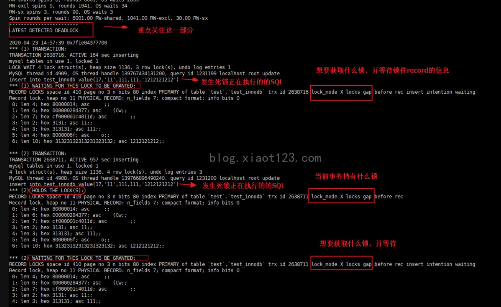

此外，也可以通过`show full processlist`命令查看当前所有数据库连接状态，如果连接在等待锁资源，在State状态会显示waiting for table metadata lock信息，同时info信息告知了造成等待的SQL语句，如果所有的等待锁的连接执行的sql语句都涉及到了同一张表，即可推知其发生了死锁。

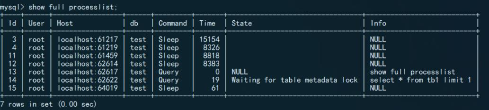

通过以上步骤可以定位至出现死锁的表，在此基础上可以**innodb_locks**、**innodb_trx**、**innodb_lock_waits**三张表查询造成死锁的数据库连接的id，通过kill id的方式处理死锁。具体处理过程如下：
① innodb_locks表包含了被加锁的表和加锁的事务的ID：lock_trx_id。
② innodb_lock_waits表中requesting_trx_id代表了申请锁资源的事务T的ID，requesting_lock_id代表T申请的锁的ID，blocking_trx_id代表了阻塞事务T的事务的ID，blocking_lock_id代表了阻塞事务T的锁的ID。根据blocking_trx_id即可找到造成死锁的事务ID。
③ 根据上述的造成死锁的事务ID可以从innodb_trx表中找到trx_mysql_thread_id，通过kill命令即可杀死对应的连接线程解除死锁。
上述过程对应的查询语句如下：

```mysql
SELECT * FROM INFORMATION_SCHEMA.INNODB_LOCKS;  --先查看当前有哪些锁
SELECT * FROM INFORMATION_SCHEMA.INNODB_LOCK_WAITS;  --再查看锁等待的对应关系
SELECT * FROM INFORMATION_SCHEMA.INNODB_TRX;  --然后查看运行的所有事务获取到对应的
-- 如果想结束死锁可以kill 上一步的trx_mysql_thread_id干掉死锁的线程
```

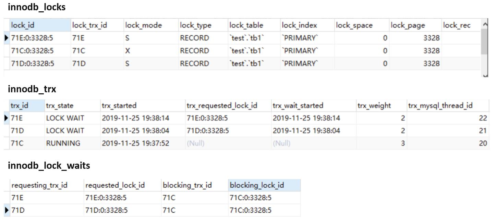

上述**innodb_locks**、**innodb_trx**、**innodb_lock_waits**三张表只能查询到innodb层的死锁，对于更高层如业务层的死锁就无法奏效了。为了减少死锁尽量遵循以下规则：
① 建立索引；
② 使用事务，尽量避免lock tables手动加锁，尽量避免长事务；
③ 尽量基于主键或唯一键更新数据；
④ 修改多个表或者多个行的时候，尽量保证顺序一致；
⑤ 最好不要用 (SELECT ... FOR UPDATE or SELECT ... LOCK IN SHARE MODE)。

参考[这里](https://blog.csdn.net/shaofei_huai/article/details/119212659)和[这里](https://zhuanlan.zhihu.com/p/93647727)。


### 9. MySQL作表连接时，表的前后顺序对join效率的影响？

使用MySQL进行查询时，例如语句：SELECT * FROM A JOIN B ON A.id = B.id; 通常情况下其中A表为**驱动表**，B表为**被驱动表**，驱动表是主动发起查询的表，查询过程中会进行全表查询，被驱动表是根据A表的查询进行结果筛选的表。事实上，MySQL的优化器会对驱动表进行自动选择，上述驱动表和被驱动表分配并不一定成立。

在不考虑MySQL优化的情况下，由于驱动表会执行全表搜索，应该尽量使用“小表”作为驱动表，并且对B表建立的匹配行(例子中的id)建立索引，通过索引优化连接效率。此处参考[这里](https://www.zhihu.com/people/yin-tong-xue-65/answers?page=2)。


### 10. 如何定义、设计业务模型？

在软件开发过程中，业务模型是一种抽象表示，用于描述系统中涉及的业务实体、其属性和关系以及业务流程。定义和设计业务模型主要涉及以下方面：
① **理解业务需求**：与业务团队合作并查看软件需求文档，深入了解业务需求，了解业务流程、规则和业务参与者之间的关系。
② **分析业务实体**：根据需求，将业务实体抽象为模型中的类或对象。包括产品、用户、订单等信息。
③ **建立关系或依赖**：在业务模型中，不同实体间存在关系或依赖，如一对一、一对多、多对多等，根据业务需求定义这些关系。
④ **设计业务逻辑**：根据业务需求，确定业务模型中的行为和业务逻辑，通过方法、规则或流程表示，以实现业务的操作和处理。
⑤ **持久化和数据模型**：将业务模型转化为数据模型，使用数据库对数据进行持久化。

在设计数据库的过程中需要遵循数据库**三范式**：
① **1NF**：关系表中每个属性都是原子的(不可再分)，每个属性都包含单一的值，不允许存在重复的属性。
② **2FN**：在1NF的基础上，要求非主键属性完全依赖于主键，不存在非主键对主键属性冗余。2NF可以减少数据的冗余度，保证一致性。
③ **3NF**：在2NF的基础上，进一步要求表中的非主键属性互不依赖，避免出现属性之间的传递依赖。


## 三、数据仓库

### 1. 说说ElasticSearch？什么是倒排索引？

ElasticSearch是一个实时的分布式存储、搜索、分析引擎。ElasticSearch相对于数据库而言强大之处在于模糊查询能力，其使用评分机制，对数据进行搜索和过滤，返回评分较高的内容作为查询结果。ElasticSearch的快速搜索和模糊匹配能力源自于**倒排索引**。

#### ElasticSearch的基本概念

类比于关系型数据库中RDB ‐> Databases ‐> Tables ‐> Rows ‐> Columns的结构，ElasticSearch中也存在类似的结构：Elasticsearch ‐> Indices ‐> Types ‐> Documents ‐> Fields。

**Index**
Index索引，类似于数据库中的Table，其为拥有相似特征的文档的集合。一个index由一个名称来标识。


#### 倒排索引

倒排索引是根据词语寻找文档内容。ES中使用字典存储所有的word，使用倒排列表存储word对应的文档索引，这样只要根据word就可以找到所有包含了word的文档的索引了，再以此查找文档即可。但是实际存储中，word的数量可能是巨大的，其无法全部放入内存，因此ES对word字典进行了**分块**+**排序**的操作，并添加了一个字典树(前缀树)存储word的前缀。ES中的倒排索引结构如下图所示：

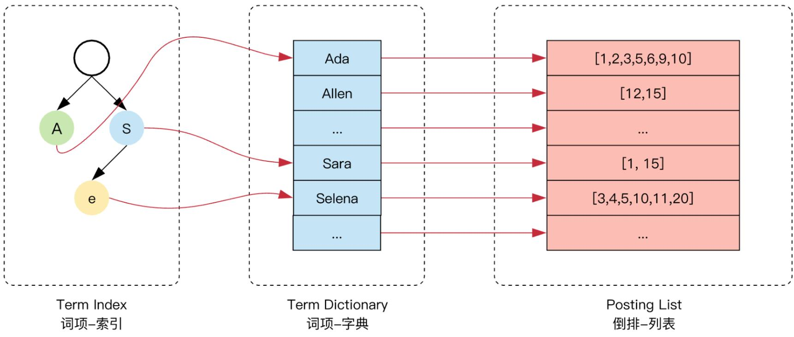

通过字典树可以实现快速的word查找。字典树中存储了词的前缀，树的叶子节点指向了字典中的一个块，这个块中存储了包含相同前缀的一系列按照顺序排序的word。当查找一个word时，首先搜索字典树获取其前缀，再根据前缀从硬盘中读取一个字典块，再使用二分法查找对应的字典项，最后根据字典项获取对应的倒排列表，倒排列表使用**FOR**(Frame Of Reference)压缩空间，并使用**RBM**(Roaring Bitmaps)快速求交并集。由于word可能数量庞大，存储前缀依然很占空间，为了节省内存使用**FST**(Finite State Transducers)对字典树进行进一步压缩操作。

#### Finite State Transducers
FST有限状态转换机，其是在前缀树的基础上复用了后缀，将前缀树变为仅一个起点和一个终点的有向无环图的结构，以提高内存利用率。为了存储word字典的索引(Value)，将索引值分散于从起点开始的路径中，并在每次添加word时，修改索引值的分布，保证索引的正确性。此处[参考](https://www.cnblogs.com/lonely-wolf/p/15464556.html)。


#### Frame Of Reference
FOR机制中使用**增量编码**+**分块存储**的方式压缩数据所占的存储空间。

**增量编码**
倒排列表不直接记录每个文档的编号，而记录第一个文档的真实编号，后面的文档编号都仅记录其相对于前一个文档编号的增量，这样能够减小编号的数值大小，能够降低空间占用。
例如[73, 300, 302, 332, 343, 372]增量编码后为[73, 227, 2, 30, 11, 29]，最大值由372变为了227。

**分块存储**
如果倒排列表中表项包含的某两个文档之间跨度过大，增量编码可能也会出现较大的数。对其进行分块，每个块单独使用一个字节表示块中每个单位的大小，可以区隔出不同跨度的编码，进一步降低内存占用。
例如[73, 227, 2, 30, 11, 29]，分成两块后为[73, 227, 2]和[30, 11, 29]，其中第一块最大值为227，需要8bit存储，则第一块每个编号都为8bit存储；第二块最大值30，5bit即可存储，则第二块每个编号都为5bit存储。

原本整型列表[73, 300, 302, 332, 343, 372]需要32bit×6=192bit=24字节存储，通过以上两种操作后，仅需[73, 227, 2]：8bit×3=24bit=3字节，[30, 11, 29]：5bit×3=15bit=2字节，总共3+2=5字节，实际数据开销由24字节降低为5字节，即便加上额外表示块内单位的1字节×2，也总共7个字节。极大地降低了空间开销。
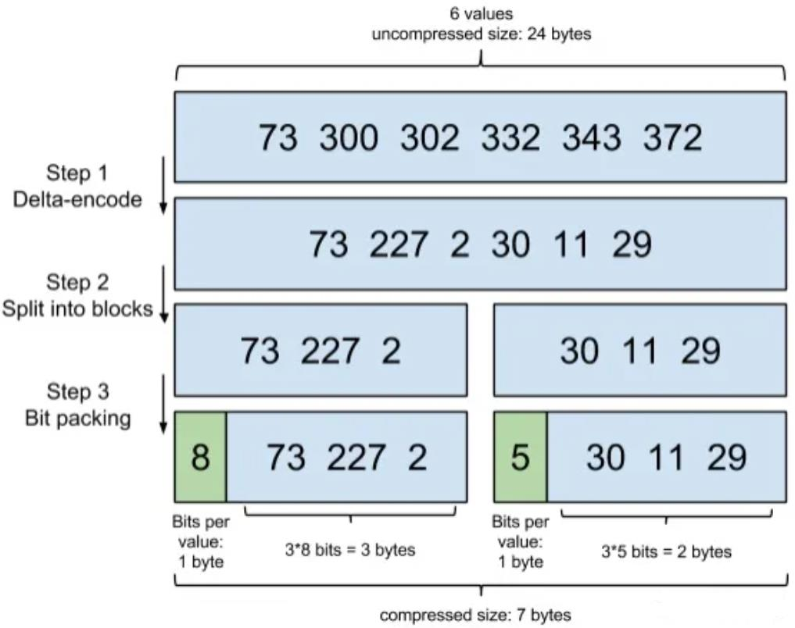


#### Roaring BitMaps

使用FOR可以有效地节省磁盘空间，存储文档编号，但将文档编号从磁盘读取到内存后通常还需要求交集和并集，为了优化这个操作，Lucene使用了**RBM**机制，以bitmap的方式保存文档编号。具体操作如下：
① 对于一个倒排列表项，取其最末尾(最大)的编号n，生成一个长度为n的比特图map。
② map[i]为0表示对应表项中没有编号为i的文档，map[i]为1则表示存在编号为1的文档。
③ 当求交集或并集时，直接使用两个表项的map求与操作和或操作即可。
使用bitmap还有一个优势，表示一个文档编号仅需要一个bit，能够进一步压缩内存占用。对于Lucene，其一个分段最多存放65536个文档编号，即最多8192字节即可表示。

需要注意，当文档数量较少但跨度较大时，bitmap中会出现大量的0，这种情况下bitmap可能反而会浪费空间，可以考虑用会整型列表的方式进行优化。


### 2. ES和MySQL的区别？

RDB的主要功能是存储数据，侧重点在于**结构数据的存储**，搜索是附带的功能；搜索引擎的主要功能是文档搜索，侧重点在于**文档的搜索**，存储是相对附带功能。此处参考[这里](https://zhuanlan.zhihu.com/p/73585202)

**精确匹配和相关性匹配**

RDB中查询通常都是**精确匹配**，例如id、name、gender等，即便是模糊查询，例如使用`%`作为通配符能够匹配相关的上下文，本质上也是“精确地”模糊查询。这种特性使其在检索精确内容时效率极高。
例如`select * from book where content like "%太阳%";`能检索出和“太阳”字符串匹配的上下文。

搜索引擎本质上是**相关性匹配**，其不仅仅是精确检索，还包含了对语义信息的分析和验证，能够分析出检索目标的同义词和相关的文档。
例如搜索“太阳”，会返回恒星、日、solar的相关内容，即便是错写为“太杨”，也能检索出正确的“太阳”的结果。

RDB适用于数据存储和需要精确查询结构化数据的场景，搜索引擎适用于面向搜索相关的场景。