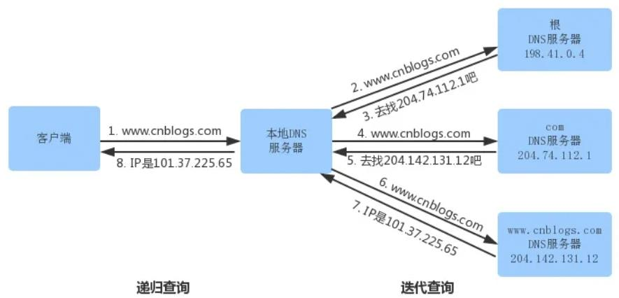
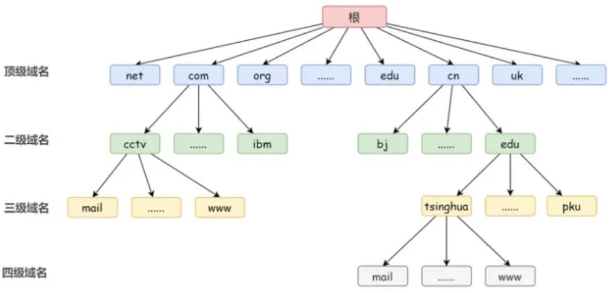
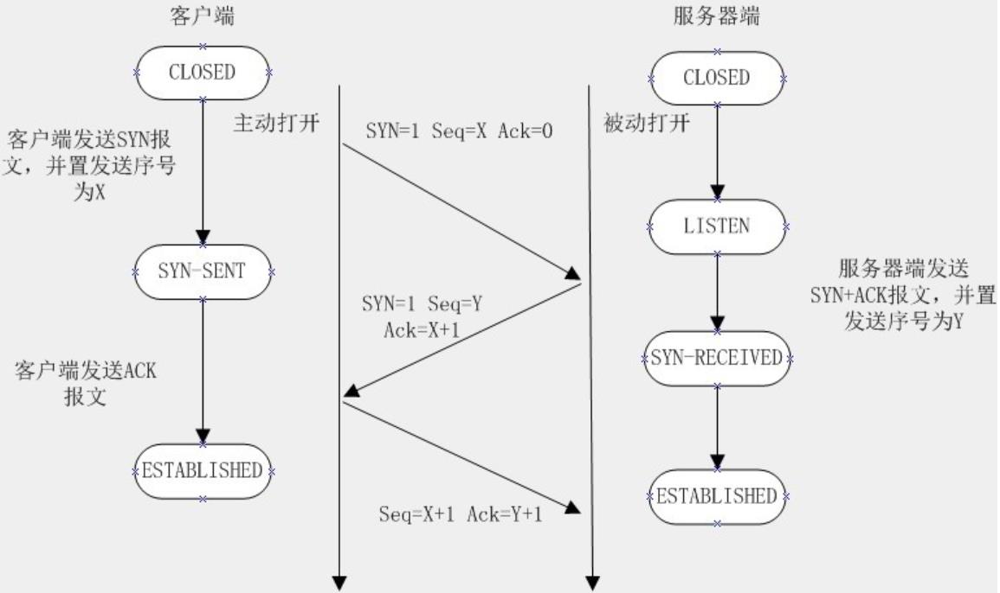
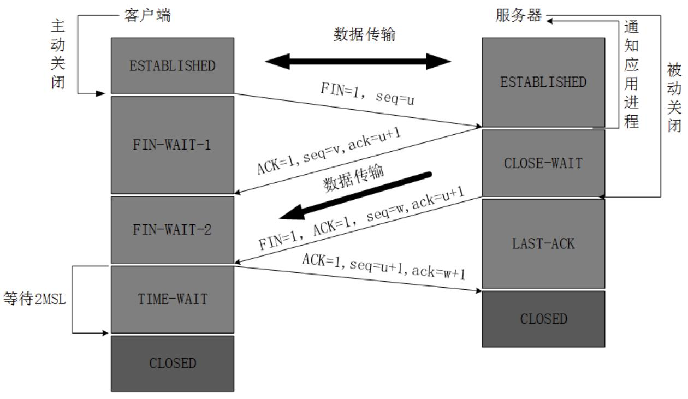
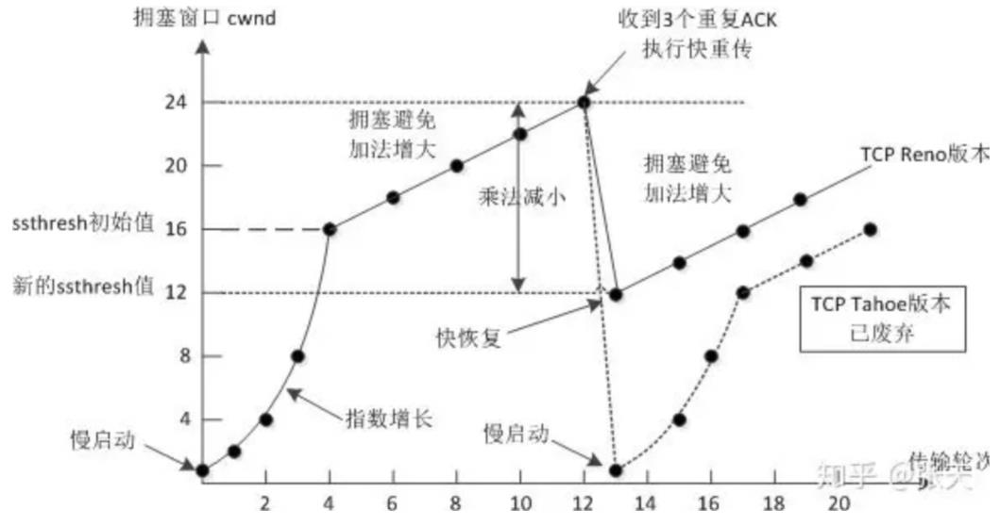

# 面试: 计算机网络相关问题


## 1. 从输入URL到页面展示发生了什么？

**① 解析URL**

浏览器拿到URL后，会首先解析URL，得到**协议**、**域名**、**端口**、**路径**等信息。

**URL**，统一资源定位符，用于定位互联网上的资源，其语法规则如下：

```
scheme://host.domain:port/path/filename
```

**scheme**: 定义**协议**类型，常见协议http、https、ftp、file等，其中https为加密网络传输。
**host**: 定义域中的**主机**，http的默认主机为www。
**domain**: 定义英特网**域名**，如bing.com、github.com、apache.org。
**port**: 定义主机**端口**号，http默认80、ftp默认20(数据)、21(控制)。
**path**: 定义服务器上的**路径**，若省略则为根路径。
**filename**: 定义文档或资源名称。

**② DNS域名解析**

**DNS**(Domain Name System) 是指通过域名查找IP，或通过IP逆向查找域名的服务。通常DNS由DNS服务器提供域名解析服务。

获取域名后，根据域名从浏览器缓存中寻找域名对应的IP；若没找到，再从操作系统中查找缓存，操作系统中的缓存保存在Hosts文件中；若仍然没有，则向DNS服务器发送查询请求，开始**递归查询**(找到最后结果再返回)；若路由器中存在缓存则直接返回；否则继续请求DNS服务器。首先会访问ISP DNS服务器，若ISP DNS仍然未找到，则其会向根服务器发出请求，开始**迭代查询**(得到部分结果返回至IPS DNS服务器)过程，最后获得目标服务器IP。递归查询和迭代查询示意图如下:




**③ 建立TCP连接**

获取IP后，浏览器会开始构造一个http请求报文，其中包括**请求头**和**请求体**(参数)，浏览器请求页面通常使用GET请求。构造好http请求报文后，会交由TCP进行发送，此时TCP协议开始建立连接。三报文握手流程如下:
客户端发送SYN=1，Seq=X的请求至服务端
服务端返回SYN=1，ACK=X+1，Seq=Y的确认响应
客户端回传ACK=Y+1，Seq=Z数据包，完成连接建立。

建立TCP连接后，发送http请求至服务器，在此过程中会继续向IP层构造数据包直到在物理层到达服务器。


**④ 服务器返回请求结果**

服务器在物理层接收到数据后，向上传递拆包，到达应用层后还原为http请求，交由服务端程序处理并返回响应。响应以http的Response对象的形式返回，其中包括**状态码**、**响应头**、**响应体**。

状态码包含以下几类：
**1XX**：请求已经接受，继续处理。
**2XX**：请求已经接收，成功处理并返回。
**3XX**：重定向，完成请求需要进一步操作。
**4XX**：客户端错误，请求无法实现。
**5XX**：服务端错误，服务器未能实现响应。

响应头主要由Cache-Control、Connection、Date、Pragma等组成。

响应体为服务器返回给浏览器的信息，主要由html、css、js、图片等构成。

HTTP状态码及其解释如下：

```
客户端错误
100  继续
101  交换协议
成功
200  OK
201  已创建
202  接收
203  非认证信息
204  无内容
205  重置内容
206  部分内容
重定向
300  多路选择
301  永久转移
302  暂时转移
303  参见其它
304  未修改（Not Modified）
305  使用代理
客户端错误
400  错误请求（Bad Request）
401  未认证
402  需要付费
403  禁止（Forbidden）
404  未找到（Not Found）
405  方法不允许
406  不接受
407  需要代理认证
408  请求超时
409  冲突
410  失败
411  需要长度
412  条件失败
413  请求实体太大
414  请求URI太长
415  不支持媒体类型
服务器错误
500  服务器内部错误
501  未实现（Not Implemented）
502  网关失败
504  网关超时
505 HTTP版本不支持
关于实体头部的内容还可以有：

Last Modified ：请求文档的最近修改时间。
Expires ：请求文档的过期时间。
Connect-length：文档数据的长度。
WWW-authenricate：通知客户端需要的认证信息。
Connect-encoding ：说明有无使用压缩技术。
Transfer-encoding ：说明采用的编码变换类型。
```


**⑤ 浏览器渲染页面**

获得响应后浏览器开始渲染页面。首先解析html，构建DOM树；再解析CSS，构建CSSOM，并将其合并为渲染树，浏览器根据渲染树绘制图层，最后将不同的图层叠加生成显示页面。

若返回的请求中包含js，则会调用JS引擎(例如V8)解析js文档，依次进行**词法分析**(生成词法单元)、**语法分析**(生成抽象语法树)、**代码生成**(生成字节码)最后运行程序。


## 2. 谈谈对DNS的理解？

DNS(Domain Name System)域名系统，是互联网的一项服务，是进行域名和与之相对应的IP地址进行转换的服务器。
域名是一个具有层次的结构，从上到下依次为顶级域名、二级域名、三级域名... 以此类推。



域名层次结构可以由上图的域名树表示，最上面的是根，但没有对应的名字。根下面一级的节点就是最高一级的顶级域名（因为根没名字，所以根下面一级域名就是顶级域名）。顶级域名往下划分就是二级域名，再往下划分就是三级四级域名。

当本机和本地DNS服务器不存在域名缓存时，会向根域名服务器发出请求(递归查询)，根域名服务器根据顶级域名解析出顶级域名服务器返回给主机，主机得到顶级域名服务器地址后向顶级域名服务器发送查询请求(迭代查询)。

DNS的两种查询方式:
**递归查询**：如果 A 请求 B，那么 B 作为请求的接收者一定要给 A 想要的答案。
**迭代查询**：如果接收者 B 没有请求者 A 所需要的准确内容，接收者 B 将告诉请求者 A，如何去获得这个内容，但是自己并不去发出请求。


## 3. HTTP底层只用TCP吗？

不是，HTTP3.0之后引入UDP协议。


## 4. 为什么HTTP3.0使用UDP？

**Head of Line Blocking问题:** HTTP2.0协议中对于同一个域名，浏览器默认只会开一个连接，所有请求都使用一个TCP连接收发。虽然不同的请求使用不同的 stream，但底层的连接只有一个。如果网络出现抖动，不论是哪一个请求的数据需要重传，其他请求的数据都必须等待。

因为 TCP 是可靠传输协议，数据必须按顺序收发，而且要边确认边发送。如果底层用 TCP 连接，就不可能解决 Head of Line blocking 问题。为HTTP3.0引入基于UDP协议设计的QUIC协议，实现面向消息的传输协议。


## 5. HTTP支持长连接吗？

支持，HTTP协议自1.1以后开始支持长连接，设置请求头中的Connection为keep-alive参数指定其为长连接。


## 6. HTTP请求头中有哪些内容？

#### 请求头内容：

**1. accept**

表示当前浏览器可以接受的文件类型，假设这里有 image/webp，表示当前浏览器可以支持 webp 格式的图片，那么当服务器给当前浏览器下发 webp 的图片时，可以更省流量。

**2. accept-encoding**

表示当前浏览器可以接受的数据编码，如果服务器吐出的数据不是浏览器可接受的编码，就会产生乱码。

**3. accept-language**

表示当前使用的浏览语言。

**4. Cookie**

很多和用户相关的信息都存在 Cookie 里，用户在向服务器发送请求数据时会带上。例如，用户在一个网站上登录了一次之后，下次访问时就不用再登录了，就是因为登录成功的 token 放在了 Cookie 中，而且随着每次请求发送给服务器，服务器就知道当前用户已登录。

**5. user-agent**

表示浏览器的版本信息。当服务器收到浏览器的这个请求后，会经过一系列处理，返回一个数据包给浏览器，而响应头里就会描述这个数据包的基本信息。

#### 响应头内容：

**1. Allow**

服务器支持的请求方法，如GET、POST等。

**2. content-encoding**

表示返回内容的压缩编码类型，如“Content-Encoding :gzip”表示这次回包是以 gzip 格式压缩编码的，这种压缩格式可以减少流量的消耗。

**3. content-length**

表示这次回包的数据大小，如果数据大小不匹配，要当作异常处理。

**4. content-type**

表示数据的格式，它是一个 HTML 页面，同时页面的编码格式是 UTF-8，按照这些信息，可以正常地解析出内容。content-type 为不同的值时，浏览器会做不同的操作，如果 content-type 是 application/octet-stream，表示数据是一个二进制流，此时浏览器会走下载文件的逻辑，而不是打开一个页面。常见的类型如下：

```
text/html：HTML格式
text/plain：纯文本格式
text/xml：xML格式
image/gif：gif格式
image/jpeg：jpeg格式
image/png：png格式
application/json：JSON格式
application/xml：xml格式
application/pdf：pdf格式
application/octet-stream：二进制流数据
application/x-www-form-urlencoded：form表单数据
multipart/form-data：表单中文件上传所用的格式
```

**5. Date**

当前的GMT时间。

**6. Expires**

文档过期时间，用于缓存清理，文档过期后浏览器不再缓存。

**4. set-cookie**

服务器通知浏览器设置一个 Cookie；通过 HTTP 的 Header，可以识别出用户的一些详细信息，方便做更定制化的需求，如果大家想探索自己发出的请求中头里面有些什么，可以这样做：打开 Chrome 浏览器并按“F12”键，唤起 Chrome 开发者工具，选择 network 这个 Tab，浏览器发出的每个请求的详情都会在这里显示。


## 7. 讲讲不同的请求方式？

HTTP中的请求方式: GET、POST、HEAD、PUT、DELETE、CONNECT、OPTIONS、TRACE（后五种在HTTP1.1版本中定义）。

**GET**：获取数据，通常请求参数置于URL中。

**POST**：将数据发送到服务器以创建或更新数据，通常请求参数置于请求体中。

**HEAD**：与GET类似，但请求后仅返回状态码，如200、404、500，等不存在响应体。

**PUT**：发送数据并取代指原数据的内容，通常用于修改数据。

**DELETE**：删除指定的数据。

**OPTIONS**: 查看服务器支持的HTTP请求方法和其相关性能参数。

**CONNECT**：建立到给定URI标识的服务器的连接。

**TRACE**：用于沿着目标资源的路径执行消息环回测试。


## 8. GET和POST的区别？

1.GET在浏览器回退时是无害的，而POST会再次提交请求。

2.GET产生的URL地址可以被Bookmark，而POST不可以。

3.GET请求会被浏览器主动cache，而POST不会，除非手动设置。

4.GET请求只能进行url编码，而POST支持多种编码方式。

5.GET请求参数会被完整保留在浏览器历史记录里，而POST中的参数不会被保留。

6.GET请求在URL中传送的参数是有长度限制的，而POST没有。

7.对参数的数据类型，GET只接受ASCII字符，而POST没有限制。

8.GET比POST更不安全，因为参数直接暴露在URL上，所以不能用来传递敏感信息。

9.GET参数通过URL传递，POST放在Request body中。

10.GET请求发送时仅需发送一个请求，POST请求发送时会发送一个请求头，服务器回传100状态码后再发送请求体，因此有两次请求。


## 9. HTTP是有状态的吗？如何保存用户状态？

HTTP本身是无状态的，HTTP协议为了保持简单性和连接效率，不会对通信状态进行持久化处理，前后请求独立处理没有关联。通常情况下，为了支持客户端与服务端的交互，可以通过额外的手段，例如Cookie或Session保存用户状态，来维护HTTP连接的状态。
因此HTTP本身无状态，但可以通过Cookie和Session保存用户状态。


## 10. 讲一下对Session和Cookie的理解，禁用Cookie怎么办？token怎么理解？存在哪里？

Cookie一般为客户端保存用户信息的方法，Session主要作用是通过服务端记录用户的状态。

**Cookie**
浏览器端第一次发送请求到服务器端之后，服务器端创建Cookie，该Cookie中包含用户的信息，然后将该Cookie发送到浏览器端，浏览器端会保存cookie至本地缓存，当再次访问服务器端时，会携带服务器端创建的Cookie，服务器端通过Cookie中携带的数据区分不同的用户。
Cookie包含: Cookie名称、Cookie值、Expire过期日期、Path访问页面、Domain子域、Secure安全性。

**Session**
浏览器端第一次发送请求到服务器端，服务器端创建一个Session，为了保证在一个会话的多次请求之间Session是同一个，同时会创建一个特殊的Cookie，其name为JSESSIONID的固定值，value为session对象的ID，然后再将该Cookie发送至浏览器端。当浏览器端第二次及之后发送请求到服务器端，浏览器端访问服务器端时就会携带该name为JSESSIONID的Cookie对象，服务器端根据name为JSESSIONID的Cookie的value，去查询Session对象，从而区分不同用户。

**不同点**
存储方式: Cookie存放于浏览器端，Session存放于服务器端；Cookie可以长期存储，Session由于存储于服务器端占用服务器资源因此会定期清除，过期时间通常为30min；Cookie最大不超过3K，Session没有固定的大小限制，取决于服务器端的性能和应用设定。

**Cookie禁用怎么办？**
禁用Cookie后，服务器无法通过cookie中的SessionId获取会话，因此Session会失效。如果在禁用cookie的情况下希望使用session则需要在发送请求时携带初次连接时服务器发送的sessionId，GET请求可以通过url携带sessionId，post请求可以通过请求体携带sessionId。

**Token怎么理解？**

Token是是服务端生成的一串字符串，以作客户端进行请求的一个令牌，当第一次登录后，服务器生成一个token便将此token返回给客户端，客户端浏览器将其缓存，以后客户端只需带上这个Token前来请求数据即可，无需再次带上用户名和密码。因为查询用户名和密码需要访问数据库，而token可以保存在session中，再次访问时无需查询数据库，减轻服务器压力。

通常使用sessionId作为token，其本身就为session的唯一标识，可以确定用户及会话。当session超时后，token也会随之失效，此时用户需要重新登录生成新的会话，并将其sessionId作为token。

在客户端，token通常存储在浏览器的LocalStorage、cookie、SessionStorage中；在服务端token存储于session中。


## 11.HTTP与HTTPS的区别？

HTTP(超文本传输协议): 默认工作在TCP的80端口，HTTP以明文的方式发送数据，不提供任何加密服务。HTTP建立仅需要三次报文握手，需要**3个包**。

HTTPS(超文本传输安全协议): 默认工作在443端口，HTTPS使用HTTP实现通信，在此基础上利用SSL/TLS加密数据包。使用HTTP时，应用程序直接将数据传递给TCP层发送，但对于HTTPS，应用程序先将数据发送给SSL/TLS进行加密，再将其传递给TCP发送。HTTPS除三报文握手外，在C/S之间协商加密协议还需要9个数据包，因此总共需要**12个包**。HTTPS的工作流程如下：

1. TCP三次报文握手
2. 客户端验证服务器数字证书
3. DH算法协商对称加密算法的密钥、hash算法的密钥
4. SSL安全加密隧道协议完成
5. 网页以加密的方式传输，使用加密算法和密钥保证数据机密性；使用hash算法保护数据完整性。

生成随机密码的算法一般使用`AES`、`RC4`等 对随机密码进行加密一般使用的算法是`RSA`算法hash算法一般是`MD5`。

HTTPS针对HTTP明文数据传输、不验证身份、不验证信息完整性的缺点，使用加密算法、数字证书、数字签名的方式，修复了HTTP传输可能出现的漏洞。


## 12. TCP三次握手

**第一次握手(SYN)**：客户端尝试连接服务器，向服务器发送请求报文。请求报文设置同步位**SYN=1**，表示请求报文；序列号**seq=x**作为客户端初始序列号。客户端进入SYN_SEND状态等待服务器确认。

**第二次握手(SYN+ACK)**：服务器接收客户端SYN包并发送确认报文。确认报文中设置同步位**SYN=1**，确认位**ACK=1**，表示请求报文；序列号**seq=y**作为服务端初始序列号，确认号**ack=x+1**作为对客户端seq=x的确认。服务端进入SYN_RCVD状态。

**第三次握手(ACK)**：客户端收到确认报文，回复确认报文，建立连接。确认报文设置确认位**ACK=1**，表示确认报文；序列号**seq=x+1**，表示该报文为第一次握手发出的seq=x的报文的下一条报文，确认号**ack=y+1**，表示对第二次握手中服务端确认报文的确认。客户端进入ESTABLISHED状态，准备传输数据，当服务端接收到该请求后也会进入ESTABLISHED状态。




### 13. 第二次握手为什么合并SYN请求和ACK确认？

第二次握手的作用：①服务器确认从客户端到服务器的连接建立；②发起从服务器到客户端的连接建立，这原本需要两次数据传输，等待两个往返时间(Round-Trip Time，RTT)，但为了减少建立连接的资源和时间开销，因此合并为一次数据传输。这本质上是一项优化措施，有助于提高建立连接的效率和减少网络资源的消耗。


## 14. TCP四次挥手

TCP四次挥手的含义是正确关闭TCP连接需要客户端和服务器之间发送四段报文。TCP关闭连接的请求可以由客户端发起也可以由服务端发起。

**第一次挥手**：客户端发送关闭连接的请求报文。请求报文设置**FIN=1**；序列号**seq=u**(前一个数据报文的序列号+1)。此时客户端进入**FIN_WAIT_1**状态，该状态下客户端任然可以接收和发送数据。

**第二次挥手**：服务器接收到客户端的关闭连接请求后，向客户端发送确认应答。应答报文设置**ACK=1**，表示确认关闭请求；**seq=v**，作为服务器端的序列号；**ack=u+1**，表示响应客户端seq=u的请求报文。
此时服务器端进入**CLOSE_WAIT**状态，服务器端任然可以发送数据，但不再接收数据。当客户端接收到确认报文后进入**FIN_WAIT_2**状态，等待服务器发送连接释放报文。此时客户端只能接收数据不再发送数据。这个过程会持续一段时间，直至服务器端发送完全部数据。

**第三次挥手**：服务器发送完全部数据后，向客户端发送连接释放请求。请求报文设置**FIN=1**，**ACK=1**，表示服务器端释放TCP连接的请求和针对客户端释放请求的响应，设置**ack=u+1**。由于有可能又发送了一些数据，因此假设序列号**seq=w**。
此时服务器端进入**LAST_ACK**状态，不再发送数据，等待客户端的最终确认。

**第四次挥手**：接收到服务器端发送的第三次挥手后，客户端发送最终确认。设置确认报文**ACK=1**，表示确认报文；设置序列号**seq=u+1**，表示接着第一次挥手的下一个报文；**ack=w+1**，表示对第三次挥手的确认。
发送完成后客户端进入**TIME_WAIT**状态，等待2个MSL(最长报文寿命)时间后，客户端释放连接进入**CLOSED**状态。服务器端一旦接收到客户端的最终确认报文后立即进入**CLOSED**状态，释放TCP连接。




### 15. 为什么建立连接是三次握手，而释放连接是四次挥手？

此问题与三次握手中第二次握手合并SYN和ACK有关。
**三次握手**：由于TCP是全双工通信，需要分别建立客户端到服务器和服务器到客户端的通信连接，本质上需要四次握手，但为了优化连接效率，三次握手过程中的第二次握手合并了客户端到服务器的ACK和服务器到客户端SYN，因此是三次握手。
**四次挥手**：释放连接时也需要分别释放双边的通信连接，因此也需要四次数据传输。客户端向服务器发起关闭连接的请求FIN后，服务器需要确认请求，因此需要回传关闭客户端到服务器连接的ACK，但此时服务器可能还在向客户端发送数据，不能关闭服务器到客户端的连接，需要等待所有数据传输完成后，再发起关闭连接的请求。综上，ACK和FIN需要单独发送。因而释放连接是四次挥手。


### 16. 为什么需要TIME_WAIT？

当客户端收到服务器的FIN请求后，需要等待两个MSL(报文最长寿命)再进入关闭状态，这个等待时间被称为TIME_WAIT状态。

TIME_WAIT是为了确保服务器接收到了客户端第四次传输的ACK，进入关闭状态。若没有TIME_WAIT客户端直接关闭，当服务器没有接收到ACK时会再次发送FIN请求关闭连接，而此时客户端已经关闭不再响应服务器的FIN请求，服务器的连接无法关闭。客户端等待TIME_WAIT就是为了在ACK丢失后重新发送ACK，保证服务器释放连接。

TIME_WAIT时长为2MSL(去向ACK的MSL和来向FIN的MSL)是为了保证之前释放连接的过程中产生的报文都自然消失，


### 17. 一个TCP连接可以发送多少个HTTP请求？

**请求头Header设置Connection: close**
当服务器发送完一个HTTP响应后会断开连接，一个TCP连接对应一个HTTP请求。

**请求头Header设置Connection: keep-alive**
完成一个HTTP请求后不会断开连接，之后的http请求会复用这个TCP连接，减少网络开销。

HTTP1.0默认为**短链接**，即Connection默认为close；HTTP1.1以后默认为**长连接**，即Connection默认为keep-alive。HTTP2.0支持**多路复用**，多个HTTP请求可以在TCP连接中同时发起，同时接收。

参考[这里](https://cloud.tencent.com/developer/article/1526057)和[这里](https://cloud.tencent.com/developer/article/2326442?areaId=106001)


### 18. HTTPS中的加密算法有哪些？AES、RSA、MD5实现原理？

HTTPS中的加密算法按照加密和解密时密钥是否相同可以分为：**对称加密**和**非对称加密**。参考[这里](	https://zhuanlan.zhihu.com/p/43789231)。

#### 对称加密

加密和解密时使用相同的密钥，数据传输时需要提前约定好加密的密钥。对称加密通常用于数据传输过程中对数据进行加密。常见的对称加密算法：DES、AES、RC4。

#### 非对称加密

加密和解密使用不同的密钥，一组密钥包含一个公钥一个私钥，获取公钥无法推断出私钥，且通过公钥加密的内容仅私钥可以解开，私钥加密的内容仅公钥可以解开。由于非对称加密非常耗时，不适合用于高密度传输下的数据加密，非对称加密通常在客户端和服务器建立连接时协商对称加密的密钥过程中使用，当建立连接后使用对称加密的方式加密传输数据。常见的非堆成加密算法：RSA、DSA/DSS。


### 19. 对称加密和非对称加密？


### 20. TCP 如何保证可靠传输？

TCP协议主要从数据的正确性、有序性、完整性和信道状态这几个方面共同保证可靠传输。

**校验和**
TCP使用校验和的方式保证数据的**正确性**。TCP中校验和计算方式为：将数据报文以16bit为一段划分为n段，将这n段按位求和，若出现进位则将进位放到段尾也作为求和的一部分，最后对全部段的求和结果取反，得到校验和。接收方在收到报文后以相同的方式计算一次，若校验和不同则说明出错，需要进行重传。

**序列号+确认应答**
TCP使用序列号和确认应答的方式保证数据的**有序性**。TCP传输时对每个数据报文都进行了编号，当发送方发送数据后需要等待接收方确认，该确认报文包含了下一个报文段的起始序列号，这样就能保证数据传输的有序性。

**超时重传**
TCP使用超时重传机制保证数据的**完整性**。发送方在发送数据后如果超过规定时间**RTO**后仍未接收到接收方的确认，则认为数据在传输过程中丢失了，这时重新传输尚未被确认的报文。通过这种方式保证数据传输的完整性，保证不出现数据丢失。
**RTO**(Retransmission Time Out)传输超时时间是根据网络状况和丢包情况动态计算的。默认时长为500ms，若网络出现一次丢包则翻倍，如果在此基础上扔丢包则继续翻倍，直到达到重试次数的上限则终止TCP连接。

**流量控制**
TCP使用滑动窗口对信道流量进行控制，进而维护信道状态。TCP使用一个16位的字段控制滑动窗口额大小，当这个值越大说明接收端缓冲区的剩余空间越大，网络的吞吐量越大。接收端在确认应答时会将自己的窗口大小信息写入确认报文，发送方根据确认报文即可确认下一次发送数据的窗口大小。若发送方接收到的窗口值为0，发送方会停止发送数据，并定期向接受方发送探测报文，获取新的窗口值。
TCP中窗口的大小由16位和一个扩大因子M共同决定，当16全为1，窗口最大化后，可以根据M继续对16位作左移操作，继续扩大窗口大小。

**拥塞控制**
TCP使用拥塞控制降低信道出现拥堵的概率，引入拥塞窗口以实现拥塞控制。在开始发送数据时，**慢启动**机制将拥塞窗口的初始值设置为1，发送较少的数据量探明网络的拥堵状况，每次收到一次ACK，则将拥塞窗口的大小翻倍，快速增长。当拥塞窗口大小超过阈值时，使用线性增长的方式控制拥塞窗口的增长速率，避免增长过快导致信道拥堵。如果发生超时重传，则慢启动的终止阈值降低为发生重传时的窗口大小的一半，同时拥塞窗口大小重置为1。




